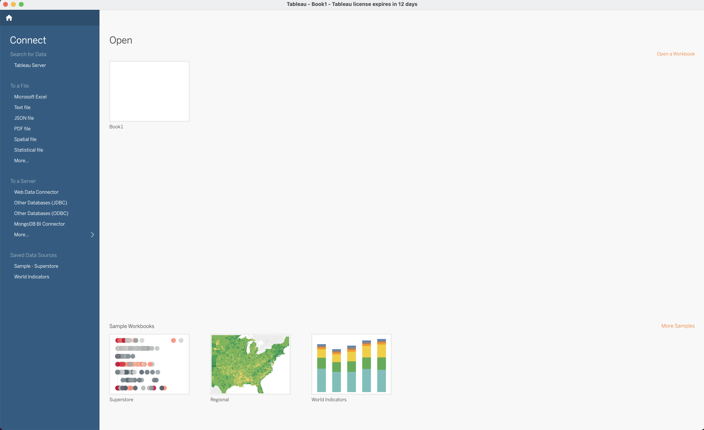
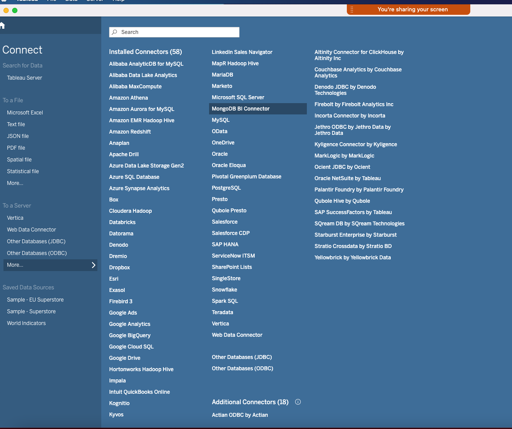
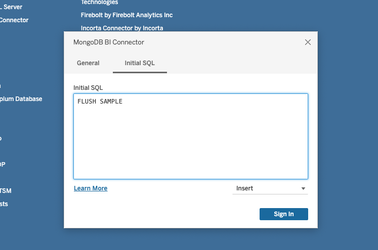
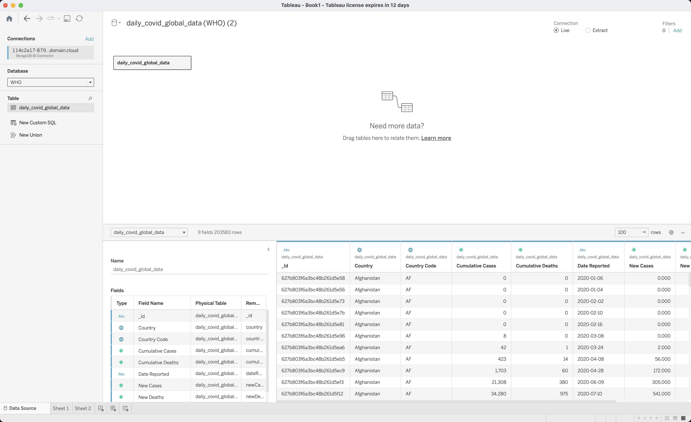
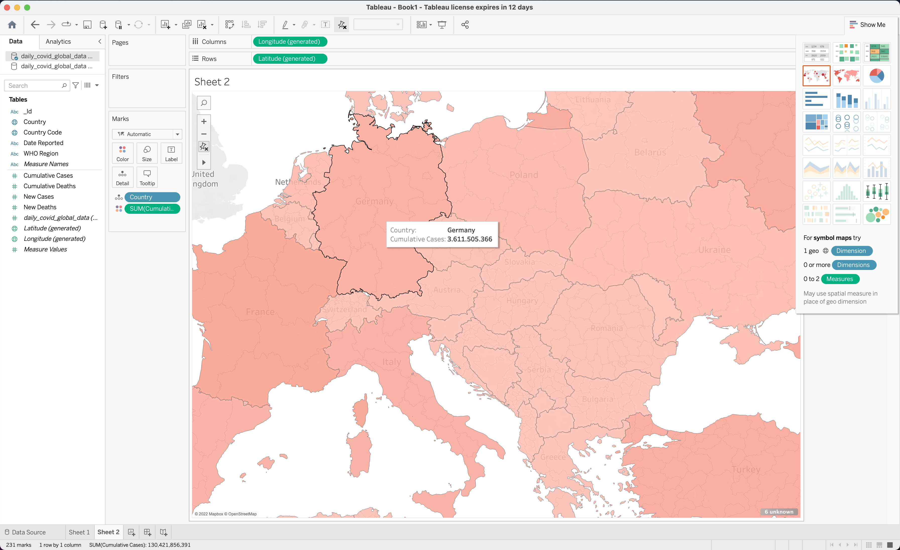

---
copyright:
  years: 2019, 2025
lastupdated: "2025-01-29"

keywords: IBM Cloud Databases, ICD, bi connector

subcollection: cloud-databases

content-type: tutorial
account-plan: paid
completion-time: 2h
---

# Mapping global COVID-19 cases with the {{site.data.keyword.databases-for-mongodb}} EE (Enterprise Edition) Analytics add-on and Tableau
{: #bi-connector-tutorial-description}
{: toc-completion-time="2h"}
{: toc-content-type="tutorial"}

The {{site.data.keyword.databases-for-mongodb}} EE (Enterprise Edition) Analytics add-on allows you to run long-running analytical queries or provision a [MongoDB Connector for business intelligence(BI)](https://docs.mongodb.com/bi-connector/current/){: .external} to make your query data compatible with BI tools, such as [Tableau](https://www.tableau.com/){: .external}.

For more information, see [{{site.data.keyword.databases-for-mongodb}} EE (Enterprise Edition) Analytics add-on](/docs/databases-for-mongodb?topic=databases-for-mongodb-mongodbee-analytics). 

This tutorial familiarizes you with the Analytics add-on using Tableau to visualize data in your MongoDB instance. In summary, you will:
- Install an instance of {{site.data.keyword.databases-for-mongodb}} EE with the Analytics add-on using [Terraform](https://www.terraform.io/intro){: .external}, a popular Infrastructure-as-Code tool.
- Upload data to your MongoDB database instance (COVID-19 data from the World Health Organization), by using basic [Node.js](https://nodejs.org/en/about/){: .external} scripting.
- Connect your database instance to Tableau.
- Generate a map visualization of COVID-19 cases around the world.

This tutorial requires some basic knowledge of the Command Line Interface (CLI) and basic knowledge of Node.js.

Because the MongoDB instance you require is not free, this tutorial is not cost-free. However, if you deprovision your resources after completion, the cost should not be more than a few dollars.{: .important}

## What you need 
{: #what-you-need}

Before you begin, it's a good idea to have:

- An [IBM Cloud](https://cloud.ibm.com/login) pay-as-you-go account, [logged in to your account](https://cloud.ibm.com/docs/cli?topic=cli-getting-started#step4-configure-idt-env).
- [Terraform](https://learn.hashicorp.com/tutorials/terraform/install-cli){: .external} - automates your resource provisioning.
- Access to a Mac or Linux terminal.
- [Node.js and npm](https://docs.npmjs.com/downloading-and-installing-node-js-and-npm).{: .external}
- [Git](https://git-scm.com/book/en/v2/Getting-Started-Installing-Git){: .external} - a free and open source-distributed version control system.
- [MongoDB Compass](https://www.mongodb.com/try/download/compass){: .external} to look at your data (optional).
- Tableau, to visualize your data. You need to set up a [30-day free trial](https://www.tableau.com/products/trial){: .external}.

## Step-by-step instructions 
{: #bi-connector-steps}

### Step 1: Obtain an API key to deploy infrastructure to your account
{: #obtain-api-key}
{: step}

Follow the steps [here](/docs/account?topic=account-userapikey&interface=ui#create_user_key) to create an API key. This key is used in Step 2.

### Step 2: Clone the repo and change directories into the Terraform directory
{: #clone-repo}
{: step}

Use the following command to clone the appropriate repo and change directories into the Terraform directory:

```sh
git clone https://github.com/IBM-Cloud/mongo-bi-tools-tutorial.git
cd mongo-bi-tools-tutorial/terraform
```
{: .codeblock}

### Step 3: Create your `terraform.tfvars` document
{: #create-terra-doc}
{: step}

Using the following command, create a document that is named `terraform.tfvars`:

```sh
ibmcloud_api_key = "<YOUR_API_KEY_FROM_STEP_1>"
region = "eu-gb" #Choose a suitable region for your deployment instance.
admin_password = "<CREATE_15_CHARACTER_PASSWORD>"
```

The `terraform.tfvars` document contains variables that you might [want to keep secret](https://docs.github.com/en/get-started/getting-started-with-git/ignoring-files){: .external}.{: .important}

### Step 4: Create your infrastructure
{: #create-infra}
{: step}

Using the following command, run the Terraform script:

```terraform
terraform init 
terraform apply --auto-approve
terraform output -json > ../import-covid-data/output.json
```
{: .codeblock}

The Terraform folder contains a number of simple scripts:
- `main.tf` tells Terraform to use {{site.data.keyword.cloud_notm}}.
- `variables.tf` contains the variable definitions whose values are populated from the `terraform.tfvars` file.
- `mongo.tf` creates a {{site.data.keyword.databases-for-mongodb}} EE instance with the Analytics add-on with the following options: 
   - 6 CPU cores 
   - 14 GB RAM
   - 20 GB memory.

The Terraform script outputs connection strings that are stored in a file named `output.json`. This file is used in the following step.

### Step 5: Upload data to your {{site.data.keyword.databases-for-mongodb}} EE instance
{: #upload-data}
{: step}

In this step, you use a Node.js script to upload data to your {{site.data.keyword.databases-for-mongodb}} EE instance. The [World Health Organization (WHO) Coronavirus (COVID-19) Dashboard](https://covid19.who.int/data){: .external} provides a daily update of COVID-19 data (deaths, vaccine utilization, and cases). 

Ensure you are in your project directory, then use the following command to import this data into your {{site.data.keyword.databases-for-mongodb}} EE instance.

```sh
cd import-covid-data
npm install
node main.js
```

The `npm install` command installs all dependencies that are needed by your script.
The `main.js` script does a number of things:

- It reads in the connection strings so that it can connect to your {{site.data.keyword.databases-for-mongodb}} EE instance.
- It reads in your `terraform.tfvars` credentials file for the password to access your {{site.data.keyword.databases-for-mongodb}} EE instance.
- It reads the COVID data file from the WHO Dashboard. This data file is in CSV format and MongoDB requires JSON format, so the script reads the data and converts it into a JSON document.
- It connects to your {{site.data.keyword.databases-for-mongodb}} EE instance and uploads all data (200k+ rows) into a collection named `daily_covid_global_data`. If the collection exists, it deletes it and starts again. You can run the script multiple times without importing duplicate data.

It takes only a few seconds to upload all of your data. You are now ready to visualize your using Tableau! The script that you ran will print the connection strings that you need for the next step.

### Step 6: Connect your database instance to Tableau
{: #connect-instance-tableau}

Connect your {{site.data.keyword.databases-for-mongodb}} EE (Enterprise Edition) Analytics add-on instance to Tableau. In the "Connect" tab, choose the MongoDB BI Connector and enter your connection information:

{: caption="Connect to Tableau" caption-side="bottom"}

{: caption="Choose to Connect to MongoDB" caption-side="bottom"} 

The server and port values come from the printed output of [Step 4](#create-infra).
Leave the database blank.
The username is "admin".
The password is the one you created in [Step 2](#clone-repo).

{: caption="Enter your MongoDB Connector Values" caption-side="bottom"} 

In the Initial SQL tab, enter "FLUSH SAMPLE" and click "Sign In"

{: caption="Type FLUSH SAMPLE" caption-side="bottom"} 

The `FLUSH SAMPLE` command tells the BI Connector to re-create the necessary tabular schema from a sample of the collection documents. Whenever your document structure changes, you need to reexecute the `FLUSH SAMPLE` command to re-create the BI Connector schema.

If your database has many documents, schema creation is a time-consuming process. You should only run `FLUSH SAMPLE` if your document structure changes or you create new collections.{: .note}

### Step 7: Visualize your data!
{: #visualize-your-data}

You can now select the WHO database on the right. Next, press "Update Now" to see the data in tabular format.

{: caption="Visualize your data in tabular format" caption-side="bottom"} 

If you select the map view from the right menu, you can also see your data in a nice map, with the columns containing country codes and the rows containing cumulative cases.

{: caption="Visualize your data in map view" caption-side="bottom"} 

### Step 8: Deprovision your infrastructure
{: #deprovision-infra}

To avoid incurring charges, remember to deprovision your resources. Terraform can take care of this. In the terminal, make sure you are in the project's `terraform` directory, then use the following command:


```terraform
terraform destroy --auto-approve
```
{: .codeblock}

To confirm that your instance is deprovisioned, check the Resources section in the [IBM Cloud Console](https://cloud.ibm.com/resources).

## Summary
{: #summary}

In this tutorial, you used Terraform to provision a {{site.data.keyword.databases-for-mongodb}} EE (Enterprise Edition) instance and then used the Analytics add-on BI Connector to visualize your data in Tableau. 

Remember, there are [offers available](https://www.ibm.com/cloud/free) to help you continue your IBM Cloud journey of discovery!{: .important}
