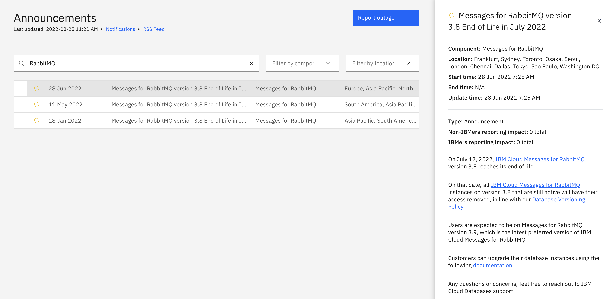

---
copyright:
  years: 2018, 2022
lastupdated: "2022-09-02"

subcollection: cloud-databases

keywords: version for cloud-databases, database version, end of life, major version, minor version, deprecate, deprecation

---

{:external: .external target="_blank"}
{:shortdesc: .shortdesc}
{:screen: .screen}
{:codeblock: .codeblock}
{:pre: .pre}


# Database Versioning Policy
{: #versioning-policy}

When you provision a {{site.data.keyword.databases-for}} deployment, you can choose from the versions currently available on {{site.data.keyword.cloud_notm}}. Find the latest versions from the [catalog pages](https://cloud.ibm.com/catalog?category=databases), the [{{site.data.keyword.IBM_notm}} {{site.data.keyword.databases-for}} CLI](/docs/databases-cli-plugin?topic=databases-cli-plugin-cdb-reference#deployables-show), or the [{{site.data.keyword.IBM_notm}} {{site.data.keyword.databases-for}} API](https://cloud.ibm.com/apidocs/cloud-databases-api#get-all-deployable-databases).

## Version Tags
{: #version-tags}

**Preferred** - The recommended and default database version for all new deployments. It's the most stable, up-to-date version of the database from both a database-level and service-level perspective.

**Preview** - A preview database version is released for a limited time to try available functions. Often it is the newest available version available from the database project maintainers in preparation for making it the "Preferred" version. While deployable, preview versions are not suitable for production, as they are excluded from service-level agreements and support. Also, a preview version isn't guaranteed to become a production-level release. IBM reserves the right to ask a customer to delete a deployment that uses a preview version.

**Deprecated** - Old versions and versions nearing their end of life dates are marked as "Deprecated". Provisions and restores of deployments that run a deprecated version are still available and deployments that are running a deprecated version continue to be supported. However, you are encouraged to upgrade to the new "Preferred" version of the database as deprecated versions are eventually removed from {{site.data.keyword.cloud_notm}} and are no longer provisionable, restorable, or supported. 

**Untagged** - Untagged database versions are fully supported and deployable versions. They are usually slightly older than the current preferred version, but they are still supported by the database project maintainers. They continue to be supported on {{site.data.keyword.databases-for}} deployments until their deprecation is announced.

## Deprecation of Major Versions
{: #version-deprecation}

{{site.data.keyword.IBM_notm}} {{site.data.keyword.databases-for}} tries to support a major version of a database for 3 years from its release. 

If a database version is deprecated or marked end of life by the open source project owners, {{site.data.keyword.IBM_notm}} {{site.data.keyword.databases-for}} takes steps to deprecate that version.

When a major version is deprecated, a six-month transition window is opened for current users of the deprecated version.

At the beginning of the period, we seek to contact users affected by the deprecation. During the six-month transition window, users are able to initiate an upgrade to a supported major version. Existing deployments continue to run as normal.

Restoration of existing databases into new deployments of the deprecated major version is available during the six-month deprecation, although we recommend upgrading to a nondeprecated major version as soon as possible.
{: .tip}

At the end of the transition window, deprecated major versions cannot be deployed on {{site.data.keyword.IBM_notm}} {{site.data.keyword.databases-for}}. A backup of the deployment is taken and access to databases that are running a deprecated version is removed or automatically upgraded to the next major version. See table 1 for which databases are upgraded or removed. Regardless, the backup is available to be restored into a new supported database version.

Failure to act can result in compatibility issues with your apps when IBM upgrades in-place. On rare occasions, failure can result, impacting your availability. If a failure occurs, the database is disabled, and you need to restore from backup. We recommend self-migrating before the end of support date.
{: .note}

## Major versions defined
{: #version-definitions}

| Database | Versioning Schema | Next Known End of Life Version and Date | End of life procedure |
| --------- | --------- | --------- | --------- |
| DataStax | Major versions are the first number in a `major.minor.patch` version number. | v6.7, [24 May 2022](https://www.ibm.com/cloud/blog/announcements/databases-for-datastax-6-7-end-of-life-in-may-2022) | Backup taken and access removed |  
| Elasticsearch | Major versions are the first number in a `release.version.maintenance` version number.| Backup taken and access removed |  
| EnterpriseDB | Major version is defined by the first number in the version number. | v12, December 2024 | Backup taken and access removed |  
| etcd | Major versions are the first number in a `major.minor.patch` version number. | v3.3, unplanned | Backup taken and access removed |  
| MongoDB | Major versions are the first two numbers in a `major.x.patch` version number. In cases where `x` is even, it is a stable release suitable for production. Even `x` versions are the only ones available on Cloud Databases. | v4.0, [26 April 2022](https://www.ibm.com/cloud/blog/announcements/databases-for-mongodb-40-end-of-life-in-april-2022) | Automatically upgraded in place to next Major version |
| PostgreSQL* | Major version is defined by the first number in the version number. | v10, [3 November 2022](https://www.ibm.com/cloud/blog/announcements/ibm-cloud-databases-for-postgresql-10-end-of-life-in-november-2022)| Backup taken and access removed |  
| Redis | Major versions are the first number in a `major.minor.patch` version number. | v4.0, [27 May 2022](https://www.ibm.com/cloud/blog/announcements/ibm-cloud-databases-for-redis-4-end-of-life-in-march-2022) | Automatically upgraded in place to next Major version only for Redis 4 to Redis 5 |  
| RabbitMQ | Major versions are the first two numbers in a `major.x.patch` version number. | v3.8, [12 July 2022](https://www.ibm.com/cloud/blog/announcements/messages-for-rabbitmq-38-end-of-life-in-july-2022) | Backup taken and access removed |  
| MySQL** | Major versions are the first two numbers in a `major.x.patch` version number. | v5.7, October 2023 | Backup taken and access removed |  
{: caption="Table 1. Major versions for {{site.data.keyword.databases-for}}" caption-side="top"}

**The versioning schema for PostgreSQL changed after version 9.6. Before and including version 9.6, a PostgreSQL major version was defined by the first two numbers in the version.*

***For more information, see [MySQL 8 GA](/docs/databases-for-mysql?topic=databases-for-mysql-mysql8-ga).*

Any actions taken after a database EOL date happen over several days after the EOL date. We try, but cannot guarantee, to make these upgrades outside of business hours in the local regions. If you want more control over the upgrade process of your database instance, we recommend that you upgrade following our [backup and restore process](/docs/cloud-databases?topic=cloud-databases-dashboard-backups) before the EOL date of your database version.
{: .note}

## Major versioning End of Life
{: #-major-version-eol}

You receive multiple notifications when a major version reaches its End of life. You can typically expect:
* A blog post, for example: [Messages for RabbitMQ 3.8 End of Life in July 2022](https://www.ibm.com/cloud/blog/announcements/messages-for-rabbitmq-38-end-of-life-in-july-2022) 
* An announcement in your service's Release Notes, for example: [IBM Cloud® Messages for RabbitMQ 3.8 End of Life in July, 2022](https://cloud.ibm.com/docs/messages-for-rabbitmq?topic=messages-for-rabbitmq-rabbitmq-relnotes#messages-for-rabbitmq-25jan2022)
* A notification by email through the {{site.data.keyword.IBM_notm}} {{site.data.keyword.databases-for}} API. This email contains a *Notifications* link that takes you to a Notifications Management page. **Make sure that these announcements are not being caught by your email service's spam filter.**
   For more information on {{site.data.keyword.cloud_notm}} distribution lists, see [Setting up Distribution Lists for IBM Cloud Notifications](https://www.ibm.com/cloud/blog/announcements/setting-up-distribution-lists-for-ibm-cloud-notifications).
   {: caption="Figure 1. Rabbit MQ Service Announcement Example" caption-side="bottom"}

For information on checking End of life status, see [Programmatic Methods for Checking Version Status](#programmatic-methods-for-checking-version-status).

### Programmatic Methods for Checking Version Status
{: #-major-version-eol-check-version-status}

The following [{{site.data.keyword.IBM_notm}} {{site.data.keyword.databases-for}} `deployables` command](/docs/databases-cli-plugin?topic=databases-cli-plugin-cdb-reference#deployables-show) shows deployable database types, specifically the available versions of databases, and their `preferred` or `stable` status.
```shell
ibmcloud cdb deployables-show [--stable] [--preferred] [--json]
```


Check the status of a major version by reviewing the output of the `deployable` command, specifically *Status* and *Preferred*. The following output example shows that version 4.4 is the `Preferred` version and version 4.2's *Status* is `deprecated`.

```text
Database Type:  mongodb
Version   Status       Preferred
4.4       stable       true
4.2       deprecated   false
```


The {{site.data.keyword.IBM_notm}} {{site.data.keyword.databases-for}} API `deployables` endpoint returns all deployable databases. Use the `version` parameter to return the version number.
```text
GET /v5/ibm/deployables
```

## Minor versions
{: #minor-versions}

{{site.data.keyword.cloud_notm}} is committed to providing secure, up-to-date versions of databases. As updates are released by database project maintainers, they are tested, evaluated, and released to {{site.data.keyword.databases-for}} deployments. Your deployment's minor version and patch updates are handled automatically and are not user configurable. 
