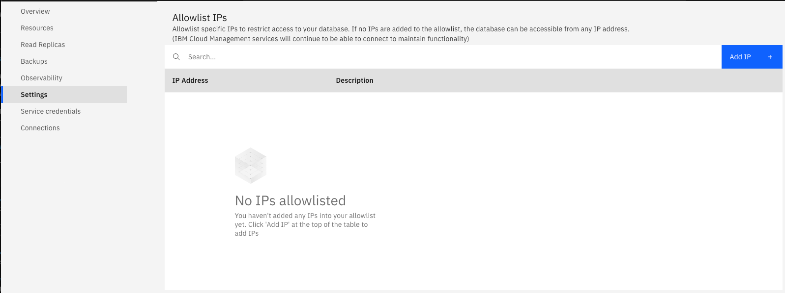

---

copyright:
  years: 2019, 2022
lastupdated: "2022-08-01"

subcollection: cloud-databases

keywords: allowlist, ip addresses, blocklist, whitelist, cloud databases allowlist

---

{:shortdesc: .shortdesc}
{:screen: .screen}
{:codeblock: .codeblock}
{:pre: .pre}
{:tip: .tip}
{:note: .note}

# Allowlisting
{: #allowlisting} 

To restrict access to your databases, you can allowlist specific IP addresses or ranges of IP addresses on your deployment.

If you use allowlists in your environment, you can allowlist our services by using the list of subnets for each region.

While IBM values the use of inclusive language, terms that are outside of IBM's direct influence are sometimes required for the sake of maintaining user understanding. As other industry leaders join IBM in embracing the use of inclusive language, IBM continues to update terminology to reflect those changes. We updated documentation to reflect changes in terminology from `whitelist` to `allowlist`. You might encounter continued references to this former terminology while we work to implement these deeper changes to code, API, and CLI commands. 
{: .note}

Each deployment is limited 100 allowlist entries. 
{: .note}

## Using IP allowlists on your Deployment
{: #ip-allowlist} 

When you create an allowlist, only IP addresses that match the allowlist or are in the range of IP addresses in the allowlist can connect to your deployment. Allowlists can be enabled for both public endpoints and private endpoints. When no IP addresses are in the allowlist, the allowlist is disabled and the deployment accepts connections from any IP address.

Even if not explicitly allowlisted, {{site.data.keyword.cloud_notm}} management services are still able to connect.
{: .tip}

### Setting an allowlist
{: #set-allowlist} 

The UI for managing allowlists is on the _Settings_ tab of your _Deployment Overview_.

{: caption="Figure 1. Deployment Overview tab" caption-side="bottom"}

#### IP addresses 
{: #set-allowlist-ip-addresses} 

The _IP_ field can take a single complete IPv4 address with or without a netmask. Without a netmask, incoming connections must come from exactly that IP address. To allow a connection from a specified range of IP addresses, use a netmask. The IP address must be fully specified. That means entering, for example, 192.168.1.0/24 rather than 192.168.1/24.

IPv6 is not currently supported.
{: tip}

#### Description
{: #set-allowlist-desc} 

The _Description_ can be any user-significant text for identifying the allowlist entry - a customer name, project identifier, or employee number, for example. The description field is required.

### Setting an allowlist through the CLI
{: #set-allowlist-cli} 

The {{site.data.keyword.databases-for}} CLI plug-in offers a set of commands for managing allowlists. Use [`cdb deployment-whitelist-add`](/docs/databases-cli-plugin?topic=databases-cli-plugin-cdb-reference#deployment-allowlist-add) to add an allowlist. For example,
```bash
ibmcloud cdb deployment-whitelist-add example-deployment 198.51.100.1 "Allowlisted for testing"
```
{: .pre}

for a single IP address and 
```bash
ibmcloud cdb deployment-whitelist-add example-deployment 198.51.100.0/24 "Testing range is now open" 
```
{: .pre}

for an IP range.

Use [`cdb deployment-whitelist-list`](/docs/databases-cli-plugin?topic=databases-cli-plugin-cdb-reference#deployment-allowlist-list) to view the current allowlist. For example,
```bash
ibmcloud cdb deployment-whitelist-list <deployment name or CRN>
```
{: .pre}

More information is on the {{site.data.keyword.databases-for}} CLI plug-in [reference page](/docs/databases-cli-plugin?topic=databases-cli-plugin-cdb-reference).

### Setting an allowlist through the API
{: #set-allowlist-api} 

To use the {{site.data.keyword.databases-for}} API to manage your allowlist with the [`/deployments/{id}/whitelists/`](https://cloud.ibm.com/apidocs/cloud-databases-api#retrieve-the-allowlisted-addresses-and-ranges-for-) endpoint. You can retrieve the current allowlist, add entries to the allowlist, and also bulk upload IP addresses to the allowlist from the API. 

More information is in the [API Reference](https://cloud.ibm.com/apidocs/cloud-databases-api)

### Removing an allowlist
{: #remove-allowlist} 

From the UI, remove an IP address or netmask from the allowlist by clicking _Remove_. You can also use CLI command is `cdb deployment-whitelist-delete` or send a `DELETE` request to the API endpoint. When all entries on the allowlist are removed, the allowlist is disabled and all IP addresses are accepted by your deployment.

## Allowlist {{site.data.keyword.databases-for}} in your Environment
{: #allowlist-ips}

If you use allowlists to control connections in your environment, you can use the following IP lists to allowlist {{site.data.keyword.databases-for}} deployments. We recommend you allowlist all of the subnet ranges for the _entire_ region that your deployments live in.

### `in-che` List
{: #che01-list} 

#### Public Subnets
{: #che01-public-list} 

| Location | Region | Data center | Subnet | First IP |
| -- | -- | -- | -- | -- |
| Channai | in-che | che01 |  169.38.95.127/27 | 169.38.95.97     |
| Channai | in-che | che01 | 169.38.121.159/28 | 169.38.121.145     |
| Channai | in-che | che01 | 169.38.132.127/25 | 169.38.132.1     |
| Channai | in-che | che01 | 169.38.136.255/26 | 169.38.136.193     |
| Channai | in-che | che01 |  169.38.73.151/29 | 169.38.73.145     |
| Channai | in-che | che01 |  169.38.105.79/29 | 169.38.105.73 |
{: caption="Table 1. in-che Public Subnets" caption-side="bottom"}

#### Private Subnets
{: #che01-private-list} 

| Location | Region | Data center | Subnet | First IP |
| -- | -- | -- | -- | -- |
| Channai | in-che | che01 |  10.162.8.127/26  | 10.162.8.65         
| Channai | in-che | che01 |  10.163.20.127/25 | 10.163.20.1         
| Channai | in-che | che01 | 10.162.115.103/29 | 10.162.115.97         
| Channai | in-che | che01 |  10.162.132.79/29 | 10.162.132.73
{: caption="Table 2. in-che Private Subnets" caption-side="bottom"}

### `ca-tor` List
{: #ca-tor-list} 

#### Public Subnets
{: #ca-tor-public-list} 

| Location | Region | Data center | Subnet | First IP |
| -- | -- | -- | -- | -- |
| Toronto | ca-tor | tor01 |  158.85.91.111/28 | 158.85.91.97 |        
| Toronto | ca-tor | tor01 |  158.85.120.63/26 | 158.85.120.1 |        
| Toronto | ca-tor | tor01 | 169.55.142.191/27 | 169.55.142.161 |         
| Toronto | ca-tor | tor01 |  158.85.95.183/29 | 158.85.95.177 |        
| Toronto | ca-tor | tor01 | 169.55.130.215/29 | 169.55.130.209 |        
| Toronto | ca-tor | tor04 |  163.74.68.95/28  | 163.74.68.81 |        
| Toronto | ca-tor | tor04 |  163.74.69.159/27 | 163.74.69.129 |         
| Toronto | ca-tor | tor04 |  163.74.72.127/26 | 163.74.72.65 |        
| Toronto | ca-tor | tor04 |  163.74.68.55/29  | 163.74.68.49 |        
| Toronto | ca-tor | tor04 |  163.74.68.63/29  | 163.74.68.57 |        
| Toronto | ca-tor | tor05 |  163.75.67.111/28 | 163.75.67.97 |        
| Toronto | ca-tor | tor05 |  163.75.68.95/27  | 163.75.68.65 |        
| Toronto | ca-tor | tor05 |  163.75.75.63/26  | 163.75.75.1 |        
| Toronto | ca-tor | tor05 |   163.75.67.7/29  | 163.75.67.1 |        
| Toronto | ca-tor | tor05 |  163.75.67.119/29 | 163.75.67.113 |
{: caption="Table 3. tor Public Subnets" caption-side="bottom"}

#### Private Subnets
{: #ca-tor-private-list} 

| Location | Region | Data center | Subnet | First IP |
| -- | -- | -- | -- | -- |
| Toronto | ca-tor | tor01 | 10.114.100.127/26 | 10.114.100.65 |        
| Toronto | ca-tor | tor01 |  10.114.79.63/29  | 10.114.79.57 |        
| Toronto | ca-tor | tor01 |  10.115.88.79/29  | 10.115.88.73 |        
| Toronto | ca-tor | tor04 |  10.11.22.127/25  | 10.11.22.1 |        
| Toronto | ca-tor | tor04 |  10.11.25.191/26  | 10.11.25.129 |        
| Toronto | ca-tor | tor04 |   10.11.12.47/29  | 10.11.12.41 |        
| Toronto | ca-tor | tor04 |   10.11.12.55/29  | 10.11.12.49 |        
| Toronto | ca-tor | tor05 |  10.243.14.255/26 | 10.243.14.193 |        
| Toronto | ca-tor | tor05 | 10.243.102.255/25 | 10.243.102.129 |        
| Toronto | ca-tor | tor05 |  10.243.23.135/29 | 10.243.23.129 |        
| Toronto | ca-tor | tor05 |  10.243.23.159/29 | 10.243.23.153 |
{: caption="Table 4. ca-tor Private Subnets" caption-side="bottom"}

### `br-sao` List
{: #br-sao-list} 

#### Public Subnets
{: #br-sao-public-list} 

| Location | Region | Data center | Subnet | First IP |
| -- | -- | -- | -- | -- |
| Sao Paolo | br-sao | sao01 | 169.57.154.239/28 | 169.57.154.225 |        
| Sao Paolo | br-sao | sao01 |  169.57.191.63/26 | 169.57.191.1 |        
| Sao Paolo | br-sao | sao01 | 169.57.198.255/25 | 169.57.198.129 |        
| Sao Paolo | br-sao | sao01 | 169.57.225.127/27 | 169.57.225.97 |        
| Sao Paolo | br-sao | sao01 |  169.57.167.95/29 | 169.57.167.89 |         
| Sao Paolo | br-sao | sao01 |  169.57.199.23/29 | 169.57.199.17 |        
| Sao Paolo | br-sao | sao04 |  163.107.67.63/28 | 163.107.67.49 |        
| Sao Paolo | br-sao | sao04 |  163.107.69.63/27 | 163.107.69.33 |        
| Sao Paolo | br-sao | sao04 | 163.107.72.127/26 | 163.107.72.65 |        
| Sao Paolo | br-sao | sao04 |  163.107.68.87/29 | 163.107.68.81 |       
| Sao Paolo | br-sao | sao04 |  163.107.68.95/29 | 163.107.68.89 |        
| Sao Paolo | br-sao | sao05 |  163.109.68.63/26 | 163.109.68.1 |       
| Sao Paolo | br-sao | sao05 |  163.109.68.95/27 | 163.109.68.65 |         
| Sao Paolo | br-sao | sao05 | 163.109.68.175/28 | 163.109.68.161 |        
| Sao Paolo | br-sao | sao05 | 163.109.65.119/29 | 163.109.65.113 |        
| Sao Paolo | br-sao | sao05 | 163.109.65.127/29 | 163.109.65.121 |
{: caption="Table 5. br-sao Public Subnets" caption-side="bottom"}

#### Private Subnets
{: #br-sao-private-list} 

| Location | Region | Data center | Subnet | First IP |
| -- | -- | -- | -- | -- |
| Sao Paolo | br-sao | sao01 | 10.150.175.255/26 | 10.150.175.193 |
| Sao Paolo | br-sao | sao01 | 10.151.137.127/25 | 10.151.137.1 |
| Sao Paolo | br-sao | sao01 | 10.150.169.167/29 | 10.150.169.161 |
| Sao Paolo | br-sao | sao01 |  10.150.207.55/29 | 10.150.207.49 |
| Sao Paolo | br-sao | sao04 |  10.14.19.127/26  | 10.14.19.65 |
| Sao Paolo | br-sao | sao04 |  10.14.41.255/25  | 10.14.41.129 |
| Sao Paolo | br-sao | sao04 |   10.14.20.63/29  | 10.14.20.57 |
| Sao Paolo | br-sao | sao04 |   10.14.21.23/29  | 10.14.21.17 |
| Sao Paolo | br-sao | sao05 |  10.15.20.191/26  | 10.15.20.129 |
| Sao Paolo | br-sao | sao05 |  10.15.31.127/25  | 10.15.31.1 |
| Sao Paolo | br-sao | sao05 |  10.15.18.183/29  | 10.15.18.177 |
| Sao Paolo | br-sao | sao05 |  10.15.18.191/29  | 10.15.18.185 |
{: caption="Table 6. br-sao Private Subnets" caption-side="bottom"}

### `eu-gb` List
{: #eu-gb-list} 

#### Public Subnets
{: #eu-gb-public-list} 

| Location | Region | Data center | Subnet | First IP |
| -- | -- | -- | -- | -- |
| London | eu-gb | lon04 |  158.175.64.95/28  | 158.175.64.81 |
| London | eu-gb | lon04 | 158.175.139.191/27 | 158.175.139.161 |
| London | eu-gb | lon04 | 158.175.147.63/26  | 158.175.147.1 |
| London | eu-gb | lon04 | 158.175.151.127/25 | 158.175.151.1 |
| London | eu-gb | lon04 | 158.175.156.255/24 | 158.175.156.1 |
| London | eu-gb | lon04 | 158.175.81.111/29  | 158.175.81.105 |
| London | eu-gb | lon04 | 158.175.91.151/29  | 158.175.91.145 |
| London | eu-gb | lon04 | 158.175.92.175/29  | 158.175.92.169 |
| London | eu-gb | lon04 |  158.175.97.7/29   | 158.175.97.1 |
| London | eu-gb | lon04 | 158.175.97.167/29  | 158.175.97.161 |
| London | eu-gb | lon04 | 158.175.125.79/29  | 158.175.125.73 |
| London | eu-gb | lon05 |  141.125.69.63/27  | 141.125.69.33 |
| London | eu-gb | lon05 |  141.125.71.15/28  | 141.125.71.1 |
| London | eu-gb | lon05 | 141.125.83.127/26  | 141.125.83.65 |
| London | eu-gb | lon05 | 141.125.88.127/25  | 141.125.88.1 |
| London | eu-gb | lon05 | 141.125.93.255/24  | 141.125.93.1 |
| London | eu-gb | lon05 |  141.125.69.31/29  | 141.125.69.25 |
| London | eu-gb | lon05 |  141.125.70.7/29   | 141.125.70.1 |
| London | eu-gb | lon05 | 141.125.77.191/29  | 141.125.77.185 |
| London | eu-gb | lon05 |  141.125.85.87/29  | 141.125.85.81 |
| London | eu-gb | lon05 |  141.125.87.55/29  | 141.125.87.49 |
| London | eu-gb | lon05 | 141.125.98.103/29  | 141.125.98.97 |
| London | eu-gb | lon06 | 158.176.109.207/28 | 158.176.109.193 |
| London | eu-gb | lon06 | 158.176.109.255/27 | 158.176.109.225 |
| London | eu-gb | lon06 | 158.176.122.63/26  | 158.176.122.1 |
| London | eu-gb | lon06 | 158.176.139.255/25 | 158.176.139.129 |
| London | eu-gb | lon06 | 158.176.148.255/24 | 158.176.148.1 |
| London | eu-gb | lon06 | 158.176.71.255/29  | 158.176.71.249 |
| London | eu-gb | lon06 | 158.176.87.135/29  | 158.176.87.129 |
| London | eu-gb | lon06 | 158.176.113.143/29 | 158.176.113.137 |
| London | eu-gb | lon06 | 158.176.122.239/29 | 158.176.122.233 |
| London | eu-gb | lon06 | 158.176.124.223/29 | 158.176.124.217 |
| London | eu-gb | lon06 | 158.176.131.15/29  | 158.176.131.9 |
{: caption="Table 7. eu-gb Public Subnets" caption-side="bottom"}

#### Private Subnets
{: #eu-gb-private-list} 

| Location | Region | Data center | Subnet | First IP |
| -- | -- | -- | -- | -- |
| London | eu-gb | lon04 |   10.45.36.63/26  | 10.45.36.1 |
| London | eu-gb | lon04 |  10.45.235.255/25 | 10.45.235.129 |
| London | eu-gb | lon04 |  10.45.245.255/24 | 10.45.245.1 |
| London | eu-gb | lon04 |   10.45.17.7/29   | 10.45.17.1 |
| London | eu-gb | lon04 |  10.45.17.135/29  | 10.45.17.129 |
| London | eu-gb | lon04 |   10.45.63.79/29  | 10.45.63.73 |
| London | eu-gb | lon04 |  10.45.63.127/29  | 10.45.63.121 |
| London | eu-gb | lon04 |  10.45.131.175/29 | 10.45.131.169 |
| London | eu-gb | lon04 |  10.45.142.247/29 | 10.45.142.241 |
| London | eu-gb | lon05 |  10.196.18.63/26  | 10.196.18.1 |
| London | eu-gb | lon05 |  10.196.54.255/25 | 10.196.54.129 |
| London | eu-gb | lon05 |  10.196.60.255/24 | 10.196.60.1 |
| London | eu-gb | lon05 | 10.196.149.255/24 | 10.196.149.1 |
| London | eu-gb | lon05 |  10.196.4.183/29  | 10.196.4.177 |
| London | eu-gb | lon05 |  10.196.12.191/29 | 10.196.12.185 |
| London | eu-gb | lon05 |  10.196.13.71/29  | 10.196.13.65 |
| London | eu-gb | lon05 |  10.196.43.231/29 | 10.196.43.225 |
| London | eu-gb | lon05 |  10.196.50.39/29  | 10.196.50.33 |
| London | eu-gb | lon05 |  10.196.50.47/29  | 10.196.50.41 |
| London | eu-gb | lon06 |  10.72.162.191/26 | 10.72.162.129 |
| London | eu-gb | lon06 |  10.72.196.255/24 | 10.72.196.1 |
| London | eu-gb | lon06 |  10.72.211.255/25 | 10.72.211.129 |
| London | eu-gb | lon06 |   10.72.9.63/29   | 10.72.9.57 |
| London | eu-gb | lon06 |   10.72.25.95/29  | 10.72.25.89 |
| London | eu-gb | lon06 |  10.72.42.215/29  | 10.72.42.209 |
| London | eu-gb | lon06 |  10.72.95.167/29  | 10.72.95.161 |
| London | eu-gb | lon06 |  10.72.127.111/29 | 10.72.127.105 |
| London | eu-gb | lon06 |  10.72.187.247/29 | 10.72.187.241 |
{: caption="Table 8. eu-gb Private Subnets" caption-side="bottom"}

### `kr-seo` List
{: #kr-seo-list} 

`SEO01` Data Center is scheduled to close on 28 October 2022. For more information (including recommended data centers to which you can migrate), see [Migrating resources to a different data center](/docs/cloud-databases?topic=cloud-databases-migrate-data-center).
{: .important}

#### Public Subnets
{: #kr-seo-public-list} 

| Location | Region | Data center | Subnet | First IP |
| -- | -- | -- | -- | -- |
| Seoul | kr-seo | seo01 |  169.56.80.143/28 | 169.56.80.129 |
| Seoul | kr-seo | seo01 |  169.56.106.63/26 | 169.56.106.1 |
| Seoul | kr-seo | seo01 | 169.56.120.127/27 | 169.56.120.97 |
| Seoul | kr-seo | seo01 | 169.56.179.255/25 | 169.56.179.129 |
| Seoul | kr-seo | seo01 |  169.56.67.239/29 | 169.56.67.233 |
| Seoul | kr-seo | seo01 |  169.56.164.71/29 | 169.56.164.65 |
{: caption="Table 9. eu-gb Public Subnets" caption-side="bottom"}

#### Private Subnets
{: #kr-seo-private-list} 

| Location | Region | Data center | Subnet | First IP |
| -- | -- | -- | -- | -- |
| Seoul | kr-seo | seo01 | 10.178.123.255/26 | 10.178.123.193 |   
| Seoul | kr-seo | seo01 | 10.178.226.127/25 | 10.178.226.1 |
| Seoul | kr-seo | seo01 | 10.178.124.175/29 | 10.178.124.169 |  
| Seoul | kr-seo | seo01 |  10.178.238.55/29 | 10.178.238.49 |
{: caption="Table 10. seo Private Subnets" caption-side="bottom"}

### `au-syd` List
{: #au-syd-list} 

#### Public Subnets
{: #au-syd-public-list} 

| Location | Region | Data center | Subnet | First IP |
| -- | -- | -- | -- | -- |
| Sydney | au-syd | syd01 |  168.1.13.127/26   | 168.1.13.65 |
| Sydney | au-syd | syd01 |   168.1.29.63/28   | 168.1.29.49 |
| Sydney | au-syd | syd01 |  168.1.216.127/27  | 168.1.216.97 |
| Sydney | au-syd | syd01 |  168.1.220.127/25  | 168.1.220.1 |
| Sydney | au-syd | syd01 |   168.1.32.79/29   | 168.1.32.73 |
| Sydney | au-syd | syd01 |   168.1.36.95/29   | 168.1.36.89 |
| Sydney | au-syd | syd01 |  168.1.62.231/29   | 168.1.62.225 |
| Sydney | au-syd | syd04 | 130.198.102.63/26  | 130.198.102.1 |
| Sydney | au-syd | syd04 | 130.198.102.159/28 | 130.198.102.145 |
| Sydney | au-syd | syd04 | 130.198.102.191/27 | 130.198.102.161 |
| Sydney | au-syd | syd04 |  168.1.108.127/25  | 168.1.108.1 |
| Sydney | au-syd | syd04 | 130.198.70.239/29  | 130.198.70.233 |
| Sydney | au-syd | syd04 | 130.198.93.135/29  | 130.198.93.129 |
| Sydney | au-syd | syd04 |  130.198.99.71/29  | 130.198.99.65 |
| Sydney | au-syd | syd05 |  135.90.68.111/28  | 135.90.68.97 |
| Sydney | au-syd | syd05 |  135.90.69.127/27  | 135.90.69.97 |
| Sydney | au-syd | syd05 |  135.90.83.63/26   | 135.90.83.1 |
| Sydney | au-syd | syd05 |  135.90.95.127/25  | 135.90.95.1 |
| Sydney | au-syd | syd05 |  135.90.67.31/29   | 135.90.67.25 |
| Sydney | au-syd | syd05 |  135.90.67.135/29  | 135.90.67.129 |
| Sydney | au-syd | syd05 |  135.90.68.39/29   | 135.90.68.33 |
{: caption="Table 11. au-syd Public Subnets" caption-side="bottom"}

#### Private Subnets
{: #au-syd-private-list} 

| Location | Region | Data center | Subnet | First IP |
| -- | -- | -- | -- | -- |
| Sydney | au-syd | syd01 | 10.138.220.255/25 | 10.138.220.129 |
| Sydney | au-syd | syd01 |  10.139.40.63/26  | 10.139.40.1 |
| Sydney | au-syd | syd01 |  10.138.152.63/29 | 10.138.152.57 |
| Sydney | au-syd | syd01 | 10.138.172.175/29 | 10.138.172.169 |
| Sydney | au-syd | syd01 | 10.138.172.183/29 | 10.138.172.177 |
| Sydney | au-syd | syd04 |  10.63.110.255/25 | 10.63.110.129 |
| Sydney | au-syd | syd04 |  10.63.212.127/26 | 10.63.212.65 |
| Sydney | au-syd | syd04 |   10.63.4.255/29  | 10.63.4.249 |
| Sydney | au-syd | syd04 |  10.63.44.103/29  | 10.63.44.97 |
| Sydney | au-syd | syd04 |  10.63.253.111/29 | 10.63.253.105 |
| Sydney | au-syd | syd05 |  10.195.4.255/26  | 10.195.4.193 |
| Sydney | au-syd | syd05 |  10.195.81.127/25 | 10.195.81.1 |
| Sydney | au-syd | syd05 |  10.195.7.239/29  | 10.195.7.233 |
| Sydney | au-syd | syd05 |  10.195.7.247/29  | 10.195.7.241 |
| Sydney | au-syd | syd05 |  10.195.46.111/29 | 10.195.46.105 |
{: caption="Table 12. au-syd Private Subnets" caption-side="bottom"}

### `jp-tok` List
{: #jp-tok-list} 

#### Public Subnets
{: #jp-tok-public-list} 

| Location | Region | Data center | Subnet | First IP |
| -- | -- | -- | -- | -- |
| Tokyo | jp-tok | tok02 | 161.202.140.191/27 | 161.202.140.161 |
| Tokyo | jp-tok | tok02 |  169.56.7.255/26   | 169.56.7.193 |
| Tokyo | jp-tok | tok02 |  169.56.30.255/25  | 169.56.30.129 |
| Tokyo | jp-tok | tok02 |  169.56.31.255/24  | 169.56.31.1 |
| Tokyo | jp-tok | tok02 |  169.56.45.175/28  | 169.56.45.161 |
| Tokyo | jp-tok | tok02 | 161.202.102.87/29  | 161.202.102.81 |
| Tokyo | jp-tok | tok02 | 161.202.145.63/29  | 161.202.145.57 |
| Tokyo | jp-tok | tok02 | 161.202.234.223/29 | 161.202.234.217 |
| Tokyo | jp-tok | tok02 | 161.202.239.191/29 | 161.202.239.185 |
| Tokyo | jp-tok | tok04 |  128.168.72.63/27  | 128.168.72.33 |
| Tokyo | jp-tok | tok04 | 128.168.72.191/28  | 128.168.72.177 |
| Tokyo | jp-tok | tok04 | 128.168.93.127/26  | 128.168.93.65 |
| Tokyo | jp-tok | tok04 | 128.168.105.127/25 | 128.168.105.1 |
| Tokyo | jp-tok | tok04 | 128.168.157.255/24 | 128.168.157.1 |
| Tokyo | jp-tok | tok04 |  128.168.69.79/29  | 128.168.69.73 |
| Tokyo | jp-tok | tok04 |  128.168.71.87/29  | 128.168.71.81 |
| Tokyo | jp-tok | tok04 |  128.168.71.95/29  | 128.168.71.89 |
| Tokyo | jp-tok | tok04 | 128.168.111.87/29  | 128.168.111.81 |
| Tokyo | jp-tok | tok05 |  165.192.71.47/28  | 165.192.71.33 |
| Tokyo | jp-tok | tok05 | 165.192.71.127/27  | 165.192.71.97 |
| Tokyo | jp-tok | tok05 | 165.192.89.255/26  | 165.192.89.193 |
| Tokyo | jp-tok | tok05 | 165.192.102.255/25 | 165.192.102.129 |
| Tokyo | jp-tok | tok05 | 165.192.157.255/24 | 165.192.157.1 |
| Tokyo | jp-tok | tok05 |  165.192.66.7/29   | 165.192.66.1 |
| Tokyo | jp-tok | tok05 | 165.192.70.175/29  | 165.192.70.169 |
| Tokyo | jp-tok | tok05 | 165.192.71.239/29  | 165.192.71.233 |
| Tokyo | jp-tok | tok05 | 165.192.148.63/29  | 165.192.148.57 |
{: caption="Table 13. tok Public Subnets" caption-side="bottom"}

#### Private Subnets
{: #jp-tok-private-list} 

| Location | Region | Data center | Subnet | First IP |
| -- | -- | -- | -- | -- |
|Tokyo | jp-tok | tok02 | 10.129.132.127/25 | 10.129.132.1 |
|Tokyo | jp-tok | tok02 | 10.129.223.255/24 | 10.129.223.1 |
|Tokyo | jp-tok | tok02 | 10.133.170.255/26 | 10.133.170.193 |
|Tokyo | jp-tok | tok02 | 10.129.121.239/29 | 10.129.121.233 |
|Tokyo | jp-tok | tok02 |  10.132.40.151/29 | 10.132.40.145 |
|Tokyo | jp-tok | tok02 |  10.133.92.159/29 | 10.133.92.153 |
|Tokyo | jp-tok | tok02 | 10.133.227.231/29 | 10.133.227.225 |
|Tokyo | jp-tok | tok04 |  10.192.23.191/26 | 10.192.23.129 |
|Tokyo | jp-tok | tok04 | 10.192.112.127/25 | 10.192.112.1 |
|Tokyo | jp-tok | tok04 | 10.192.131.255/24 | 10.192.131.1 |
|Tokyo | jp-tok | tok04 |  10.192.18.87/29  | 10.192.18.81 |
|Tokyo | jp-tok | tok04 |  10.192.22.79/29  | 10.192.22.73 |
|Tokyo | jp-tok | tok04 |   10.192.69.7/29  | 10.192.69.1 |
|Tokyo | jp-tok | tok04 |  10.192.138.15/29 | 10.192.138.9 |
|Tokyo | jp-tok | tok05 |  10.193.12.191/26 | 10.193.12.129 |
|Tokyo | jp-tok | tok05 | 10.193.105.255/25 | 10.193.105.129 |
|Tokyo | jp-tok | tok05 | 10.193.193.255/24 | 10.193.193.1 |
|Tokyo | jp-tok | tok05 |  10.193.15.167/29 | 10.193.15.161 |
|Tokyo | jp-tok | tok05 |  10.193.19.39/29  | 10.193.19.33 |
|Tokyo | jp-tok | tok05 |  10.193.76.255/29 | 10.193.76.249 |
|Tokyo | jp-tok | tok05 | 10.193.103.175/29 | 10.193.103.169 |
{: caption="Table 14. tok Private Subnets" caption-side="bottom"}       

### `jp-osa` List
{: #jp-osa-list} 

#### Public Subnets
{: #jp-osa-public-list} 

| Location | Region | Data center | Subnet | First IP |
| -- | -- | -- | -- | -- |
| Osaka | jp-osa | osa21 | 163.68.68.127/28 | 163.68.68.113 |
| Osaka | jp-osa | osa21 | 163.68.73.127/27 | 163.68.73.97 |
| Osaka | jp-osa | osa21 | 163.68.96.191/26 | 163.68.96.129 |
| Osaka | jp-osa | osa21 | 163.68.67.119/29 | 163.68.67.113 |
| Osaka | jp-osa | osa21 | 163.68.70.63/29  | 163.68.70.57 |
| Osaka | jp-osa | osa22 | 163.69.65.111/28 | 163.69.65.97 |
| Osaka | jp-osa | osa22 | 163.69.68.31/27  | 163.69.68.1 |
| Osaka | jp-osa | osa22 | 163.69.71.255/26 | 163.69.71.193 |
| Osaka | jp-osa | osa22 | 163.69.65.55/29  | 163.69.65.49 |
| Osaka | jp-osa | osa22 | 163.69.65.63/29  | 163.69.65.57 |
| Osaka | jp-osa | osa23 | 163.73.65.175/28 | 163.73.65.161 |
| Osaka | jp-osa | osa23 | 163.73.68.95/27  | 163.73.68.65 |
| Osaka | jp-osa | osa23 | 163.73.71.63/26  | 163.73.71.1 |
| Osaka | jp-osa | osa23 | 163.73.67.191/29 | 163.73.67.185 |
| Osaka | jp-osa | osa23 | 163.73.67.231/29 | 163.73.67.225 |
{: caption="Table 15. jp-osa Public Subnets" caption-side="bottom"}  

#### Private Subnets
{: #jp-osa-private-list} 

| Location | Region | Data center | Subnet | First IP |
| -- | -- | -- | -- | -- |
| Osaka | jp-osa | osa21 |  10.8.22.255/26 | 10.8.22.193 |        
| Osaka | jp-osa | osa21 |  10.8.16.159/29 | 10.8.16.153 |        
| Osaka | jp-osa | osa21 |  10.8.16.167/29 | 10.8.16.161 |        
| Osaka | jp-osa | osa22 |  10.9.12.127/26 | 10.9.12.65 |        
| Osaka | jp-osa | osa22 |  10.9.6.207/29  | 10.9.6.201 |   
| Osaka | jp-osa | osa22 |  10.9.6.215/29  | 10.9.6.209 |        
| Osaka | jp-osa | osa23 | 10.10.12.255/26 | 10.10.12.193 |        
| Osaka | jp-osa | osa23 |   10.10.8.7/29  | 10.10.8.1 |        
| Osaka | jp-osa | osa23 |  10.10.8.15/29  | 10.10.8.9 |
{: caption="Table 16. jp-osa Private Subnets" caption-side="bottom"}  

### `us-east` List
{: #us-east-list} 

#### Public Subnets
{: #us-east-public-list} 

| Location | Region | Data center | Subnet | First IP |
| -- | -- | -- | -- | -- |
| Washington DC | us-east | wdc04 |  52.116.78.127/25  | 52.116.78.1 |     
| Washington DC | us-east | wdc04 | 52.116.115.255/24  | 52.116.115.1 |      
| Washington DC | us-east | wdc04 | 150.239.70.255/24  | 150.239.70.1 |      
| Washington DC | us-east | wdc04 | 150.239.101.255/24 | 150.239.101.1 |       
| Washington DC | us-east | wdc04 |  169.47.179.63/26  | 169.47.179.1 |      
| Washington DC | us-east | wdc04 |  169.63.72.175/28  | 169.63.72.161 |       
| Washington DC | us-east | wdc04 | 169.63.121.159/27  | 169.63.121.129 |        
| Washington DC | us-east | wdc04 |  52.116.73.231/29  | 52.116.73.225 |       
| Washington DC | us-east | wdc04 | 169.47.179.231/29  | 169.47.179.225 |        
| Washington DC | us-east | wdc04 |  169.63.86.31/29   | 169.63.86.25 |      
| Washington DC | us-east | wdc04 | 169.63.111.119/29  | 169.63.111.113 |        
| Washington DC | us-east | wdc04 |  169.63.121.55/29  | 169.63.121.49 |       
| Washington DC | us-east | wdc04 |  169.63.121.63/29  | 169.63.121.57 |       
| Washington DC | us-east | wdc04 | 169.63.123.167/29  | 169.63.123.161 |        
| Washington DC | us-east | wdc04 | 169.63.125.223/29  | 169.63.125.217 |        
| Washington DC | us-east | wdc06 | 169.59.138.255/24  | 169.59.138.1 |      
| Washington DC | us-east | wdc06 | 169.59.144.255/24  | 169.59.144.1 |      
| Washington DC | us-east | wdc06 | 169.59.158.255/24  | 169.59.158.1 |      
| Washington DC | us-east | wdc06 | 169.63.128.191/27  | 169.63.128.161 |        
| Washington DC | us-east | wdc06 | 169.63.135.191/28  | 169.63.135.177 |        
| Washington DC | us-east | wdc06 | 169.63.139.255/26  | 169.63.139.193 |        
| Washington DC | us-east | wdc06 | 169.63.172.127/25  | 169.63.172.1 |      
| Washington DC | us-east | wdc06 | 169.59.145.239/29  | 169.59.145.233 |        
| Washington DC | us-east | wdc06 |  169.60.65.55/29   | 169.60.65.49 |      
| Washington DC | us-east | wdc06 |   169.60.89.7/29   | 169.60.89.1 |     
| Washington DC | us-east | wdc06 |   169.60.93.7/29   | 169.60.93.1 |     
| Washington DC | us-east | wdc06 |  169.60.95.151/29  | 169.60.95.145 |       
| Washington DC | us-east | wdc06 | 169.63.129.119/29  | 169.63.129.113 |        
| Washington DC | us-east | wdc06 | 169.63.141.239/29  | 169.63.141.233 |        
| Washington DC | us-east | wdc06 | 169.63.149.199/29  | 169.63.149.193 |        
| Washington DC | us-east | wdc07 | 52.117.104.255/24  | 52.117.104.1 |      
| Washington DC | us-east | wdc07 | 150.239.194.255/24 | 150.239.194.1 |       
| Washington DC | us-east | wdc07 |  169.61.123.95/28  | 169.61.123.81 |       
| Washington DC | us-east | wdc07 |  169.62.36.255/24  | 169.62.36.1 |     
| Washington DC | us-east | wdc07 |  169.62.42.63/27   | 169.62.42.33 |      
| Washington DC | us-east | wdc07 |  169.62.54.191/26  | 169.62.54.129 |       
| Washington DC | us-east | wdc07 |  169.62.60.127/25  | 169.62.60.1 |     
| Washington DC | us-east | wdc07 |  52.117.76.47/29   | 52.117.76.41 |      
| Washington DC | us-east | wdc07 |  52.117.85.71/29   | 52.117.85.65 |      
| Washington DC | us-east | wdc07 |  169.61.73.231/29  | 169.61.73.225 |       
| Washington DC | us-east | wdc07 |  169.61.95.15/29   | 169.61.95.9 |     
| Washington DC | us-east | wdc07 |  169.61.113.39/29  | 169.61.113.33 |       
| Washington DC | us-east | wdc07 |  169.61.113.47/29  | 169.61.113.41 |       
| Washington DC | us-east | wdc07 | 169.61.122.159/29  | 169.61.122.153 |        
| Washington DC | us-east | wdc07 |   169.62.6.87/29   | 169.62.6.81 |
{: caption="Table 17. us-east Public Subnets" caption-side="bottom"}  

#### Private Subnets
{: #us-east-private-list} 

| Location | Region | Data center | Subnet | First IP |
| -- | -- | -- | -- | -- |
| Washington DC | us-east | wdc04 |  10.65.119.255/25 | 10.65.119.129  |       
| Washington DC | us-east | wdc04 |  10.65.145.255/26 | 10.65.145.193  |       
| Washington DC | us-east | wdc04 |  10.211.67.255/24 | 10.211.67.1    |     
| Washington DC | us-east | wdc04 |  10.211.96.255/24 | 10.211.96.1    |     
| Washington DC | us-east | wdc04 | 10.211.126.255/24 | 10.211.126.1   |      
| Washington DC | us-east | wdc04 |    10.65.0.7/29   | 10.65.0.1      |   
| Washington DC | us-east | wdc04 |  10.65.99.103/29  | 10.65.99.97    |     
| Washington DC | us-east | wdc04 |  10.65.145.95/29  | 10.65.145.89   |      
| Washington DC | us-east | wdc04 |  10.65.152.223/29 | 10.65.152.217  |       
| Washington DC | us-east | wdc04 |  10.65.179.159/29 | 10.65.179.153  |       
| Washington DC | us-east | wdc04 |  10.65.218.247/29 | 10.65.218.241  |       
| Washington DC | us-east | wdc04 |  10.65.224.15/29  | 10.65.224.9    |     
| Washington DC | us-east | wdc04 |  10.65.224.23/29  | 10.65.224.17   |      
| Washington DC | us-east | wdc06 | 10.188.150.255/24 | 10.188.150.1   |      
| Washington DC | us-east | wdc06 | 10.188.160.127/26 | 10.188.160.65  |       
| Washington DC | us-east | wdc06 |  10.189.7.127/25  | 10.189.7.1     |    
| Washington DC | us-east | wdc06 |  10.189.91.255/24 | 10.189.91.1    |     
| Washington DC | us-east | wdc06 | 10.189.159.255/24 | 10.189.159.1   |      
| Washington DC | us-east | wdc06 |  10.188.34.31/29  | 10.188.34.25   |      
| Washington DC | us-east | wdc06 |  10.188.35.231/29 | 10.188.35.225  |       
| Washington DC | us-east | wdc06 |  10.188.53.127/29 | 10.188.53.121  |       
| Washington DC | us-east | wdc06 | 10.188.137.247/29 | 10.188.137.241 |        
| Washington DC | us-east | wdc06 | 10.188.140.143/29 | 10.188.140.137 |        
| Washington DC | us-east | wdc06 |  10.188.199.95/29 | 10.188.199.89  |       
| Washington DC | us-east | wdc06 |  10.189.13.23/29  | 10.189.13.17   |      
| Washington DC | us-east | wdc06 |  10.189.45.223/29 | 10.189.45.217  |       
| Washington DC | us-east | wdc07 |  10.39.58.255/24  | 10.39.58.1     |    
| Washington DC | us-east | wdc07 |  10.39.62.255/24  | 10.39.62.1     |    
| Washington DC | us-east | wdc07 |  10.190.86.191/26 | 10.190.86.129  |       
| Washington DC | us-east | wdc07 | 10.191.126.127/25 | 10.191.126.1   |      
| Washington DC | us-east | wdc07 | 10.191.213.255/24 | 10.191.213.1   |      
| Washington DC | us-east | wdc07 |  10.190.22.175/29 | 10.190.22.169  |       
| Washington DC | us-east | wdc07 | 10.190.123.143/29 | 10.190.123.137 |        
| Washington DC | us-east | wdc07 |  10.190.166.39/29 | 10.190.166.33  |       
| Washington DC | us-east | wdc07 | 10.190.233.215/29 | 10.190.233.209 |        
| Washington DC | us-east | wdc07 |  10.191.11.127/29 | 10.191.11.121  |       
| Washington DC | us-east | wdc07 |  10.191.12.175/29 | 10.191.12.169  |       
| Washington DC | us-east | wdc07 |  10.191.49.247/29 | 10.191.49.241  |       
| Washington DC | us-east | wdc07 |  10.191.115.7/29  | 10.191.115.1   |
{: caption="Table 18. us-east Private Subnets" caption-side="bottom"}  

### `eu-de` List
{: #eu-de-list} 

#### Public Subnets
{: #eu-de-public-list} 

| Location | Region | Data center | Subnet | First IP |
| -- | -- | -- | -- | -- |
| Frankfurt | eu-de | fra02 | 158.177.41.255/24  | 158.177.41.1      |  
| Frankfurt | eu-de | fra02 | 158.177.56.255/24  | 158.177.56.1      |  
| Frankfurt | eu-de | fra02 | 158.177.61.255/24  | 158.177.61.1      |  
| Frankfurt | eu-de | fra02 |  158.177.77.63/27  | 158.177.77.33     |   
| Frankfurt | eu-de | fra02 | 158.177.87.255/25  | 158.177.87.129    |    
| Frankfurt | eu-de | fra02 | 158.177.155.63/26  | 158.177.155.1     |   
| Frankfurt | eu-de | fra02 | 158.177.241.255/24 | 158.177.241.1     |   
| Frankfurt | eu-de | fra02 | 158.177.110.111/29 | 158.177.110.105   |     
| Frankfurt | eu-de | fra02 | 158.177.221.175/29 | 158.177.221.169   |     
| Frankfurt | eu-de | fra02 |  159.122.89.23/29  | 159.122.89.17     |   
| Frankfurt | eu-de | fra02 |  159.122.97.23/29  | 159.122.97.17     |   
| Frankfurt | eu-de | fra02 |  159.122.97.47/29  | 159.122.97.41     |   
| Frankfurt | eu-de | fra02 | 159.122.108.215/29 | 159.122.108.209   |     
| Frankfurt | eu-de | fra02 | 159.122.108.223/29 | 159.122.108.217   |     
| Frankfurt | eu-de | fra02 |  169.50.10.15/29   | 169.50.10.9       | 
| Frankfurt | eu-de | fra02 |  169.50.13.207/29  | 169.50.13.201     |   
| Frankfurt | eu-de | fra02 |  169.50.15.31/29   | 169.50.15.25      |  
| Frankfurt | eu-de | fra02 |  169.50.15.191/29  | 169.50.15.185     |   
| Frankfurt | eu-de | fra02 |  169.50.25.231/29  | 169.50.25.225     |   
| Frankfurt | eu-de | fra02 |  169.50.35.111/29  | 169.50.35.105     |   
| Frankfurt | eu-de | fra02 |  169.50.35.239/29  | 169.50.35.233     |   
| Frankfurt | eu-de | fra02 |  169.50.53.247/29  | 169.50.53.241     |   
| Frankfurt | eu-de | fra02 |  169.50.54.23/29   | 169.50.54.17      |  
| Frankfurt | eu-de | fra04 |  161.156.2.255/24  | 161.156.2.1       | 
| Frankfurt | eu-de | fra04 | 161.156.25.255/24  | 161.156.25.1      |  
| Frankfurt | eu-de | fra04 | 161.156.51.255/24  | 161.156.51.1      |  
| Frankfurt | eu-de | fra04 | 161.156.95.223/27  | 161.156.95.193    |    
| Frankfurt | eu-de | fra04 |  161.156.97.63/26  | 161.156.97.1      |  
| Frankfurt | eu-de | fra04 | 161.156.131.255/25 | 161.156.131.129   |     
| Frankfurt | eu-de | fra04 | 161.156.152.255/24 | 161.156.152.1     |   
| Frankfurt | eu-de | fra04 |  161.156.1.79/29   | 161.156.1.73      |  
| Frankfurt | eu-de | fra04 |  161.156.8.47/29   | 161.156.8.41      |  
| Frankfurt | eu-de | fra04 | 161.156.38.207/29  | 161.156.38.201    |    
| Frankfurt | eu-de | fra04 | 161.156.67.247/29  | 161.156.67.241    |    
| Frankfurt | eu-de | fra04 | 161.156.69.135/29  | 161.156.69.129    |    
| Frankfurt | eu-de | fra04 | 161.156.69.143/29  | 161.156.69.137    |    
| Frankfurt | eu-de | fra04 | 161.156.107.159/29 | 161.156.107.153   |     
| Frankfurt | eu-de | fra04 | 161.156.111.55/29  | 161.156.111.49    |    
| Frankfurt | eu-de | fra04 | 161.156.111.79/29  | 161.156.111.73    |    
| Frankfurt | eu-de | fra04 | 161.156.122.239/29 | 161.156.122.233   |     
| Frankfurt | eu-de | fra04 | 161.156.132.103/29 | 161.156.132.97    |    
| Frankfurt | eu-de | fra04 | 161.156.148.215/29 | 161.156.148.209   |     
| Frankfurt | eu-de | fra04 | 161.156.157.135/29 | 161.156.157.129   |     
| Frankfurt | eu-de | fra04 | 161.156.177.183/29 | 161.156.177.177   |     
| Frankfurt | eu-de | fra04 | 161.156.185.31/29  | 161.156.185.25    |    
| Frankfurt | eu-de | fra04 | 161.156.190.127/29 | 161.156.190.121   |     
| Frankfurt | eu-de | fra05 |  149.81.73.159/28  | 149.81.73.145     |   
| Frankfurt | eu-de | fra05 |  149.81.80.255/27  | 149.81.80.225     |   
| Frankfurt | eu-de | fra05 |  149.81.114.63/26  | 149.81.114.1      |  
| Frankfurt | eu-de | fra05 | 149.81.132.127/25  | 149.81.132.1      |  
| Frankfurt | eu-de | fra05 | 149.81.139.255/24  | 149.81.139.1      |  
| Frankfurt | eu-de | fra05 | 149.81.150.255/24  | 149.81.150.1      |  
| Frankfurt | eu-de | fra05 | 149.81.183.255/24  | 149.81.183.1      |  
| Frankfurt | eu-de | fra05 | 149.81.208.255/24  | 149.81.208.1      |  
| Frankfurt | eu-de | fra05 |  149.81.65.255/29  | 149.81.65.249     |   
| Frankfurt | eu-de | fra05 |  149.81.77.207/29  | 149.81.77.201     |   
| Frankfurt | eu-de | fra05 |  149.81.79.183/29  | 149.81.79.177     |   
| Frankfurt | eu-de | fra05 |  149.81.83.215/29  | 149.81.83.209     |   
| Frankfurt | eu-de | fra05 |  149.81.84.103/29  | 149.81.84.97      |  
| Frankfurt | eu-de | fra05 |  149.81.87.143/29  | 149.81.87.137     |   
| Frankfurt | eu-de | fra05 |  149.81.87.151/29  | 149.81.87.145     |   
| Frankfurt | eu-de | fra05 |  149.81.98.167/29  | 149.81.98.161     |   
| Frankfurt | eu-de | fra05 | 149.81.100.207/29  | 149.81.100.201    |    
| Frankfurt | eu-de | fra05 | 149.81.101.119/29  | 149.81.101.113    |    
| Frankfurt | eu-de | fra05 | 149.81.106.239/29  | 149.81.106.233    |    
| Frankfurt | eu-de | fra05 | 149.81.114.175/29  | 149.81.114.169    |    
| Frankfurt | eu-de | fra05 |  149.81.142.47/29  | 149.81.142.41     |   
| Frankfurt | eu-de | fra05 |  149.81.148.79/29  | 149.81.148.73     |   
| Frankfurt | eu-de | fra05 | 149.81.171.231/29  | 149.81.171.225    |    
| Frankfurt | eu-de | fra05 | 149.81.180.207/29  | 149.81.180.201    |    
| Paris | eu-de | par01 |  159.8.70.111/28  | 159.8.70.97            |
| Paris | eu-de | par01 |  159.8.90.127/26  | 159.8.90.65            |
| Paris | eu-de | par01 |  159.8.114.127/27 | 159.8.114.97           | 
| Paris | eu-de | par01 |  159.8.78.239/29  | 159.8.78.233           |
| Paris | eu-de | par01 |   159.8.94.95/29  | 159.8.94.89            |
{: caption="Table 19. eu-de Public Subnets" caption-side="bottom"}  

#### Private Subnets
{: #eu-de-private-list} 

| Location | Region | Data center | Subnet | First IP |
| -- | -- | -- | -- | -- |
| Frankfurt | eu-de | fra02 |  10.20.34.255/24  | 10.20.34.1        |
| Frankfurt | eu-de | fra02 | 10.134.228.255/24 | 10.134.228.1        |
| Frankfurt | eu-de | fra02 |   10.194.5.63/26  | 10.194.5.1        |
| Frankfurt | eu-de | fra02 |  10.194.98.255/25 | 10.194.98.129        |
| Frankfurt | eu-de | fra02 | 10.194.205.255/24 | 10.194.205.1        |
| Frankfurt | eu-de | fra02 | 10.215.194.255/24 | 10.215.194.1        |
| Frankfurt | eu-de | fra02 |  10.134.41.111/29 | 10.134.41.105        |
| Frankfurt | eu-de | fra02 |  10.134.57.143/29 | 10.134.57.137        |
| Frankfurt | eu-de | fra02 |  10.134.68.47/29  | 10.134.68.41        |
| Frankfurt | eu-de | fra02 | 10.134.191.167/29 | 10.134.191.161       | 
| Frankfurt | eu-de | fra02 | 10.134.195.207/29 | 10.134.195.201       | 
| Frankfurt | eu-de | fra02 | 10.134.199.247/29 | 10.134.199.241       | 
| Frankfurt | eu-de | fra02 | 10.134.236.207/29 | 10.134.236.201       | 
| Frankfurt | eu-de | fra02 | 10.134.247.207/29 | 10.134.247.201       | 
| Frankfurt | eu-de | fra02 |  10.135.17.103/29 | 10.135.17.97        |
| Frankfurt | eu-de | fra02 |  10.135.61.239/29 | 10.135.61.233        |
| Frankfurt | eu-de | fra02 |  10.135.84.111/29 | 10.135.84.105        |
| Frankfurt | eu-de | fra02 |  10.135.87.103/29 | 10.135.87.97        |
| Frankfurt | eu-de | fra02 | 10.135.120.143/29 | 10.135.120.137       | 
| Frankfurt | eu-de | fra02 |  10.135.123.31/29 | 10.135.123.25        |
| Frankfurt | eu-de | fra02 |  10.135.158.47/29 | 10.135.158.41        |
| Frankfurt | eu-de | fra02 |  10.135.180.7/29  | 10.135.180.1        |
| Frankfurt | eu-de | fra02 |  10.135.180.15/29 | 10.135.180.9        |
| Frankfurt | eu-de | fra04 |  10.21.72.255/24  | 10.21.72.1        |
| Frankfurt | eu-de | fra04 |  10.75.68.191/26  | 10.75.68.129        |
| Frankfurt | eu-de | fra04 |  10.75.134.127/25 | 10.75.134.1        |
| Frankfurt | eu-de | fra04 |  10.75.234.255/24 | 10.75.234.1        |
| Frankfurt | eu-de | fra04 | 10.240.146.255/24 | 10.240.146.1        |
| Frankfurt | eu-de | fra04 | 10.240.181.255/24 | 10.240.181.1        |
| Frankfurt | eu-de | fra04 |   10.75.35.55/29  | 10.75.35.49        |
| Frankfurt | eu-de | fra04 |  10.75.74.151/29  | 10.75.74.145        |
| Frankfurt | eu-de | fra04 |  10.75.80.239/29  | 10.75.80.233        |
| Frankfurt | eu-de | fra04 |   10.75.82.23/29  | 10.75.82.17        |
| Frankfurt | eu-de | fra04 |   10.75.82.39/29  | 10.75.82.33        |
| Frankfurt | eu-de | fra04 |   10.75.82.47/29  | 10.75.82.41        |
| Frankfurt | eu-de | fra04 |  10.75.127.79/29  | 10.75.127.73        |
| Frankfurt | eu-de | fra04 |  10.75.166.47/29  | 10.75.166.41        |
| Frankfurt | eu-de | fra04 |  10.75.166.79/29  | 10.75.166.73        |
| Frankfurt | eu-de | fra04 |  10.75.210.39/29  | 10.75.210.33        |
| Frankfurt | eu-de | fra04 |  10.75.219.103/29 | 10.75.219.97        |
| Frankfurt | eu-de | fra04 |  10.75.221.103/29 | 10.75.221.97        |
| Frankfurt | eu-de | fra04 |  10.240.20.103/29 | 10.240.20.97        |
| Frankfurt | eu-de | fra04 |  10.240.53.215/29 | 10.240.53.209        |
| Frankfurt | eu-de | fra04 |  10.240.160.31/29 | 10.240.160.25        |
| Frankfurt | eu-de | fra04 | 10.240.166.183/29 | 10.240.166.177       | 
| Frankfurt | eu-de | fra04 |  10.240.228.71/29 | 10.240.228.65        |
| Frankfurt | eu-de | fra05 |  10.13.21.255/24  | 10.13.21.1        |
| Frankfurt | eu-de | fra05 |  10.13.175.255/24 | 10.13.175.1        |
| Frankfurt | eu-de | fra05 |  10.123.14.63/26  | 10.123.14.1        |
| Frankfurt | eu-de | fra05 |  10.123.55.127/25 | 10.123.55.1        |
| Frankfurt | eu-de | fra05 | 10.123.167.255/24 | 10.123.167.1        |
| Frankfurt | eu-de | fra05 | 10.123.241.255/24 | 10.123.241.1        |
| Frankfurt | eu-de | fra05 |  10.13.10.151/29  | 10.13.10.145        |
| Frankfurt | eu-de | fra05 |   10.13.35.71/29  | 10.13.35.65        |
| Frankfurt | eu-de | fra05 |  10.123.22.151/29 | 10.123.22.145        |
| Frankfurt | eu-de | fra05 |  10.123.53.15/29  | 10.123.53.9        |
| Frankfurt | eu-de | fra05 |  10.123.59.103/29 | 10.123.59.97        |
| Frankfurt | eu-de | fra05 |  10.123.60.167/29 | 10.123.60.161        |
| Frankfurt | eu-de | fra05 |  10.123.63.199/29 | 10.123.63.193        |
| Frankfurt | eu-de | fra05 |  10.123.64.199/29 | 10.123.64.193        |
| Frankfurt | eu-de | fra05 |  10.123.64.247/29 | 10.123.64.241        |
| Frankfurt | eu-de | fra05 |  10.123.87.191/29 | 10.123.87.185        |
| Frankfurt | eu-de | fra05 |  10.123.99.127/29 | 10.123.99.121        |
| Frankfurt | eu-de | fra05 | 10.123.108.111/29 | 10.123.108.105       | 
| Frankfurt | eu-de | fra05 | 10.123.123.151/29 | 10.123.123.145       | 
| Frankfurt | eu-de | fra05 |  10.123.179.15/29 | 10.123.179.9        |
| Frankfurt | eu-de | fra05 | 10.123.182.127/29 | 10.123.182.121       | 
| Frankfurt | eu-de | fra05 |  10.123.208.95/29 | 10.123.208.89        |
| Frankfurt | eu-de | fra05 | 10.123.253.207/29 | 10.123.253.201       | 
| Paris| eu-de | par01 | 10.126.152.127/25 | 10.126.152.1        |
| Paris| eu-de | par01 |  10.127.213.63/26 | 10.127.213.1        |
| Paris| eu-de | par01 |  10.126.23.255/29 | 10.126.23.249        |
| Paris| eu-de | par01 | 10.126.100.135/29 | 10.126.100.129 |
{: caption="Table 20. eu-de Private Subnets" caption-side="bottom"} 

### `us-south` List
{: #us-south-list}

#### Public Subnets
{: #us-south-public-list}

| Location | Region | Data center | Subnet | First IP |
| -- | -- | -- | -- | -- |
| Dallas | us-south | dal10 | 52.116.167.255/24  | 52.116.167.1        | 
| Dallas | us-south | dal10 | 52.116.179.175/28  | 52.116.179.161      |   
| Dallas | us-south | dal10 |  52.116.190.63/26  | 52.116.190.1        | 
| Dallas | us-south | dal10 | 52.117.150.127/25  | 52.117.150.1        | 
| Dallas | us-south | dal10 | 52.117.184.255/24  | 52.117.184.1        | 
| Dallas | us-south | dal10 |  52.118.10.255/24  | 52.118.10.1         |
| Dallas | us-south | dal10 |  52.118.48.255/24  | 52.118.48.1         |
| Dallas | us-south | dal10 | 52.118.138.255/24  | 52.118.138.1        | 
| Dallas | us-south | dal10 | 150.238.244.255/24 | 150.238.244.1       |  
| Dallas | us-south | dal10 | 150.239.46.255/24  | 150.239.46.1        | 
| Dallas | us-south | dal10 | 150.239.63.255/24  | 150.239.63.1        | 
| Dallas | us-south | dal10 |  169.46.57.31/27   | 169.46.57.1         |
| Dallas | us-south | dal10 | 169.47.212.191/27  | 169.47.212.161      |   
| Dallas | us-south | dal10 | 169.61.212.255/26  | 169.61.212.193      |   
| Dallas | us-south | dal10 | 169.61.219.239/28  | 169.61.219.225      |   
| Dallas | us-south | dal10 | 169.63.201.255/25  | 169.63.201.129      |   
| Dallas | us-south | dal10 | 169.63.204.255/24  | 169.63.204.1        | 
| Dallas | us-south | dal10 | 52.116.160.151/29  | 52.116.160.145      |   
| Dallas | us-south | dal10 | 52.116.190.135/29  | 52.116.190.129      |   
| Dallas | us-south | dal10 | 52.116.190.239/29  | 52.116.190.233      |   
| Dallas | us-south | dal10 |  52.117.148.31/29  | 52.117.148.25       |  
| Dallas | us-south | dal10 | 52.117.166.239/29  | 52.117.166.233      |   
| Dallas | us-south | dal10 |  52.118.41.103/29  | 52.118.41.97        | 
| Dallas | us-south | dal10 | 52.118.153.159/29  | 52.118.153.153      |   
| Dallas | us-south | dal10 |  150.238.4.151/29  | 150.238.4.145       |  
| Dallas | us-south | dal10 | 150.238.229.39/29  | 150.238.229.33      |   
| Dallas | us-south | dal10 | 150.238.247.167/29 | 150.238.247.161     |    
| Dallas | us-south | dal10 |  169.46.13.239/29  | 169.46.13.233       |  
| Dallas | us-south | dal10 |  169.46.17.87/29   | 169.46.17.81        | 
| Dallas | us-south | dal10 |  169.46.18.23/29   | 169.46.18.17        | 
| Dallas | us-south | dal10 |  169.46.21.175/29  | 169.46.21.169       |  
| Dallas | us-south | dal10 |  169.46.21.183/29  | 169.46.21.177       |  
| Dallas | us-south | dal10 |  169.46.25.103/29  | 169.46.25.97        | 
| Dallas | us-south | dal10 |  169.46.31.175/29  | 169.46.31.169       |  
| Dallas | us-south | dal10 |  169.46.39.199/29  | 169.46.39.193       |  
| Dallas | us-south | dal10 |   169.46.40.7/29   | 169.46.40.1         |
| Dallas | us-south | dal10 |  169.46.42.215/29  | 169.46.42.209       |  
| Dallas | us-south | dal10 |  169.46.50.239/29  | 169.46.50.233       |  
| Dallas | us-south | dal10 |  169.46.51.63/29   | 169.46.51.57        | 
| Dallas | us-south | dal10 |  169.46.51.111/29  | 169.46.51.105       |  
| Dallas | us-south | dal10 |  169.46.60.23/29   | 169.46.60.17        | 
| Dallas | us-south | dal10 |  169.46.65.191/29  | 169.46.65.185       |  
| Dallas | us-south | dal10 |  169.46.71.143/29  | 169.46.71.137       |  
| Dallas | us-south | dal10 |  169.46.76.71/29   | 169.46.76.65        | 
| Dallas | us-south | dal10 |  169.46.78.15/29   | 169.46.78.9         |
| Dallas | us-south | dal10 |  169.46.81.175/29  | 169.46.81.169       |  
| Dallas | us-south | dal10 |  169.46.91.55/29   | 169.46.91.49        | 
| Dallas | us-south | dal10 |  169.46.97.79/29   | 169.46.97.73        | 
| Dallas | us-south | dal10 |  169.46.99.103/29  | 169.46.99.97        | 
| Dallas | us-south | dal10 |  169.46.99.175/29  | 169.46.99.169       |  
| Dallas | us-south | dal10 |  169.46.110.7/29   | 169.46.110.1        | 
| Dallas | us-south | dal10 |  169.46.110.87/29  | 169.46.110.81       |  
| Dallas | us-south | dal10 | 169.46.120.183/29  | 169.46.120.177      |   
| Dallas | us-south | dal10 | 169.46.121.215/29  | 169.46.121.209      |   
| Dallas | us-south | dal10 |  169.47.193.79/29  | 169.47.193.73       |  
| Dallas | us-south | dal10 |  169.47.194.95/29  | 169.47.194.89       |  
| Dallas | us-south | dal10 |  169.47.195.47/29  | 169.47.195.41       |  
| Dallas | us-south | dal10 | 169.47.195.111/29  | 169.47.195.105      |   
| Dallas | us-south | dal10 | 169.47.197.207/29  | 169.47.197.201      |   
| Dallas | us-south | dal10 | 169.47.203.167/29  | 169.47.203.161      |   
| Dallas | us-south | dal10 |  169.47.205.31/29  | 169.47.205.25       |  
| Dallas | us-south | dal10 | 169.47.214.167/29  | 169.47.214.161      |   
| Dallas | us-south | dal10 | 169.47.228.255/29  | 169.47.228.249      |   
| Dallas | us-south | dal10 | 169.47.229.119/29  | 169.47.229.113      |   
| Dallas | us-south | dal10 | 169.47.233.167/29  | 169.47.233.161      |   
| Dallas | us-south | dal10 | 169.47.236.111/29  | 169.47.236.105      |   
| Dallas | us-south | dal10 |  169.47.246.39/29  | 169.47.246.33       |  
| Dallas | us-south | dal10 |  169.47.251.87/29  | 169.47.251.81       |  
| Dallas | us-south | dal10 | 169.47.252.135/29  | 169.47.252.129      |   
| Dallas | us-south | dal10 |  169.48.135.79/29  | 169.48.135.73       |  
| Dallas | us-south | dal10 |  169.48.139.79/29  | 169.48.139.73       |  
| Dallas | us-south | dal10 | 169.48.140.143/29  | 169.48.140.137      |   
| Dallas | us-south | dal10 | 169.48.161.199/29  | 169.48.161.193      |   
| Dallas | us-south | dal10 | 169.48.163.135/29  | 169.48.163.129      |   
| Dallas | us-south | dal10 | 169.48.164.151/29  | 169.48.164.145      |   
| Dallas | us-south | dal10 |  169.48.171.87/29  | 169.48.171.81       |  
| Dallas | us-south | dal10 |  169.60.61.223/29  | 169.60.61.217       |  
| Dallas | us-south | dal10 | 169.60.229.175/29  | 169.60.229.169      |   
| Dallas | us-south | dal10 | 169.61.193.127/29  | 169.61.193.121      |   
| Dallas | us-south | dal10 | 169.61.214.175/29  | 169.61.214.169      |   
| Dallas | us-south | dal10 | 169.61.216.143/29  | 169.61.216.137      |   
| Dallas | us-south | dal10 |  169.61.235.63/29  | 169.61.235.57       |  
| Dallas | us-south | dal10 | 169.63.194.159/29  | 169.63.194.153      |   
| Dallas | us-south | dal10 |  169.63.195.39/29  | 169.63.195.33       |  
| Dallas | us-south | dal10 | 169.63.218.119/29  | 169.63.218.113      |   
| Dallas | us-south | dal10 |  169.63.220.39/29  | 169.63.220.33       |  
| Dallas | us-south | dal12 |  50.22.135.255/24  | 50.22.135.1         |
| Dallas | us-south | dal12 | 52.116.212.255/24  | 52.116.212.1        | 
| Dallas | us-south | dal12 | 52.116.218.191/27  | 52.116.218.161      |   
| Dallas | us-south | dal12 | 52.116.229.255/25  | 52.116.229.129      |   
| Dallas | us-south | dal12 | 52.116.252.255/24  | 52.116.252.1        | 
| Dallas | us-south | dal12 | 52.118.193.255/24  | 52.118.193.1        | 
| Dallas | us-south | dal12 | 52.118.197.255/24  | 52.118.197.1        | 
| Dallas | us-south | dal12 | 52.118.203.255/24  | 52.118.203.1        | 
| Dallas | us-south | dal12 | 150.239.149.255/24 | 150.239.149.1       |  
| Dallas | us-south | dal12 | 150.239.187.255/24 | 150.239.187.1       |  
| Dallas | us-south | dal12 | 169.47.108.255/26  | 169.47.108.193      |   
| Dallas | us-south | dal12 | 169.48.215.191/27  | 169.48.215.161      |   
| Dallas | us-south | dal12 | 169.59.194.255/24  | 169.59.194.1        | 
| Dallas | us-south | dal12 | 169.59.234.255/24  | 169.59.234.1        | 
| Dallas | us-south | dal12 | 169.61.157.255/25  | 169.61.157.129      |   
| Dallas | us-south | dal12 |  169.61.167.31/28  | 169.61.167.17       |  
| Dallas | us-south | dal12 |  169.61.169.63/28  | 169.61.169.49       |  
| Dallas | us-south | dal12 |  169.63.57.127/26  | 169.63.57.65        | 
| Dallas | us-south | dal12 |  50.22.153.191/29  | 50.22.153.185       |  
| Dallas | us-south | dal12 | 52.116.234.199/29  | 52.116.234.193      |   
| Dallas | us-south | dal12 | 52.116.244.119/29  | 52.116.244.113      |   
| Dallas | us-south | dal12 |  52.116.254.31/29  | 52.116.254.25       |  
| Dallas | us-south | dal12 |  169.47.101.7/29   | 169.47.101.1        | 
| Dallas | us-south | dal12 |  169.47.101.15/29  | 169.47.101.9        | 
| Dallas | us-south | dal12 |  169.47.101.63/29  | 169.47.101.57       |  
| Dallas | us-south | dal12 |  169.47.107.95/29  | 169.47.107.89       |  
| Dallas | us-south | dal12 | 169.47.107.151/29  | 169.47.107.145      |   
| Dallas | us-south | dal12 |  169.47.109.87/29  | 169.47.109.81       |  
| Dallas | us-south | dal12 |  169.47.111.79/29  | 169.47.111.73       |  
| Dallas | us-south | dal12 | 169.47.113.223/29  | 169.47.113.217      |   
| Dallas | us-south | dal12 |  169.47.124.95/29  | 169.47.124.89       |  
| Dallas | us-south | dal12 | 169.48.207.175/29  | 169.48.207.169      |   
| Dallas | us-south | dal12 |  169.48.216.47/29  | 169.48.216.41       |  
| Dallas | us-south | dal12 | 169.48.218.143/29  | 169.48.218.137      |   
| Dallas | us-south | dal12 | 169.48.222.135/29  | 169.48.222.129      |   
| Dallas | us-south | dal12 | 169.48.236.183/29  | 169.48.236.177      |   
| Dallas | us-south | dal12 | 169.48.240.199/29  | 169.48.240.193      |   
| Dallas | us-south | dal12 | 169.48.241.167/29  | 169.48.241.161      |   
| Dallas | us-south | dal12 |  169.59.203.47/29  | 169.59.203.41       |  
| Dallas | us-south | dal12 | 169.59.203.247/29  | 169.59.203.241      |   
| Dallas | us-south | dal12 | 169.59.225.191/29  | 169.59.225.185      |   
| Dallas | us-south | dal12 | 169.59.255.119/29  | 169.59.255.113      |   
| Dallas | us-south | dal12 | 169.61.133.159/29  | 169.61.133.153      |   
| Dallas | us-south | dal12 | 169.61.133.223/29  | 169.61.133.217      |   
| Dallas | us-south | dal12 | 169.61.136.175/29  | 169.61.136.169      |   
| Dallas | us-south | dal12 | 169.61.138.231/29  | 169.61.138.225      |   
| Dallas | us-south | dal12 |  169.61.139.79/29  | 169.61.139.73       |  
| Dallas | us-south | dal12 | 169.61.139.103/29  | 169.61.139.97       |  
| Dallas | us-south | dal12 | 169.61.150.223/29  | 169.61.150.217      |   
| Dallas | us-south | dal12 | 169.61.170.151/29  | 169.61.170.145      |   
| Dallas | us-south | dal12 | 169.61.178.111/29  | 169.61.178.105      |   
| Dallas | us-south | dal12 | 169.61.190.103/29  | 169.61.190.97       |  
| Dallas | us-south | dal12 |   169.63.1.79/29   | 169.63.1.73         |
| Dallas | us-south | dal12 |   169.63.2.79/29   | 169.63.2.73         |
| Dallas | us-south | dal12 |  169.63.18.71/29   | 169.63.18.65        | 
| Dallas | us-south | dal12 |  169.63.21.175/29  | 169.63.21.169       |  
| Dallas | us-south | dal12 |  169.63.21.191/29  | 169.63.21.185       |  
| Dallas | us-south | dal12 |   169.63.25.7/29   | 169.63.25.1         |
| Dallas | us-south | dal12 |  169.63.26.15/29   | 169.63.26.9         |
| Dallas | us-south | dal12 |  169.63.26.255/29  | 169.63.26.249       |  
| Dallas | us-south | dal12 |   169.63.27.7/29   | 169.63.27.1         |
| Dallas | us-south | dal12 |  169.63.29.47/29   | 169.63.29.41        | 
| Dallas | us-south | dal12 |   169.63.31.7/29   | 169.63.31.1         |
| Dallas | us-south | dal12 |  169.63.34.207/29  | 169.63.34.201       |  
| Dallas | us-south | dal12 |  169.63.47.87/29   | 169.63.47.81        | 
| Dallas | us-south | dal12 |  169.63.54.175/29  | 169.63.54.169       |  
| Dallas | us-south | dal12 |  169.63.55.143/29  | 169.63.55.137       |  
| Dallas | us-south | dal12 |  169.63.58.71/29   | 169.63.58.65        | 
| Dallas | us-south | dal12 |  169.63.58.79/29   | 169.63.58.73        | 
| Dallas | us-south | dal13 |  52.116.16.127/25  | 52.116.16.1         |
| Dallas | us-south | dal13 |  52.116.24.63/27   | 52.116.24.33        | 
| Dallas | us-south | dal13 |  52.116.47.255/24  | 52.116.47.1         |
| Dallas | us-south | dal13 |  52.116.60.255/24  | 52.116.60.1         |
| Dallas | us-south | dal13 |  52.117.49.255/24  | 52.117.49.1         |
| Dallas | us-south | dal13 | 52.117.198.191/26  | 52.117.198.129      |   
| Dallas | us-south | dal13 | 52.117.202.255/25  | 52.117.202.129      |   
| Dallas | us-south | dal13 | 52.117.205.255/24  | 52.117.205.1        | 
| Dallas | us-south | dal13 | 52.117.230.255/24  | 52.117.230.1        | 
| Dallas | us-south | dal13 | 52.117.235.255/24  | 52.117.235.1        | 
| Dallas | us-south | dal13 | 52.117.254.255/24  | 52.117.254.1        | 
| Dallas | us-south | dal13 | 67.228.229.255/24  | 67.228.229.1        | 
| Dallas | us-south | dal13 | 67.228.234.255/24  | 67.228.234.1        | 
| Dallas | us-south | dal13 | 150.238.107.255/24 | 150.238.107.1       |  
| Dallas | us-south | dal13 | 150.238.113.255/24 | 150.238.113.1       |  
| Dallas | us-south | dal13 |  169.48.76.63/27   | 169.48.76.33        | 
| Dallas | us-south | dal13 |  169.59.14.255/24  | 169.59.14.1         |
| Dallas | us-south | dal13 |  169.61.32.159/29  | 169.61.32.153       |  
| Dallas | us-south | dal13 | 169.62.218.223/28  | 169.62.218.209      |   
| Dallas | us-south | dal13 |  169.62.237.63/26  | 169.62.237.1        | 
| Dallas | us-south | dal13 |  52.116.17.159/29  | 52.116.17.153       |  
| Dallas | us-south | dal13 |  52.116.19.183/29  | 52.116.19.177       |  
| Dallas | us-south | dal13 |  52.116.19.191/29  | 52.116.19.185       |  
| Dallas | us-south | dal13 |  52.116.25.247/29  | 52.116.25.241       |  
| Dallas | us-south | dal13 |  52.116.32.39/29   | 52.116.32.33        | 
| Dallas | us-south | dal13 |  52.116.54.239/29  | 52.116.54.233       |  
| Dallas | us-south | dal13 |  52.117.22.247/29  | 52.117.22.241       |  
| Dallas | us-south | dal13 |  52.117.23.143/29  | 52.117.23.137       |  
| Dallas | us-south | dal13 |  52.117.31.119/29  | 52.117.31.113       |  
| Dallas | us-south | dal13 |  52.117.35.231/29  | 52.117.35.225       |  
| Dallas | us-south | dal13 |  52.117.55.95/29   | 52.117.55.89        | 
| Dallas | us-south | dal13 |  52.117.55.119/29  | 52.117.55.113       |  
| Dallas | us-south | dal13 |  52.117.62.127/29  | 52.117.62.121       |  
| Dallas | us-south | dal13 | 52.117.234.183/29  | 52.117.234.177      |   
| Dallas | us-south | dal13 | 52.117.252.207/29  | 52.117.252.201      |   
| Dallas | us-south | dal13 | 150.238.100.247/29 | 150.238.100.241     |    
| Dallas | us-south | dal13 |  169.48.71.167/29  | 169.48.71.161       |  
| Dallas | us-south | dal13 |  169.48.71.175/29  | 169.48.71.169       |  
| Dallas | us-south | dal13 |  169.48.78.95/29   | 169.48.78.89        | 
| Dallas | us-south | dal13 |  169.48.96.71/29   | 169.48.96.65        | 
| Dallas | us-south | dal13 |  169.48.98.199/29  | 169.48.98.193       |  
| Dallas | us-south | dal13 |  169.48.98.231/29  | 169.48.98.225       |  
| Dallas | us-south | dal13 |  169.48.99.119/29  | 169.48.99.113       |  
| Dallas | us-south | dal13 |  169.48.107.79/29  | 169.48.107.73       |  
| Dallas | us-south | dal13 | 169.48.114.247/29  | 169.48.114.241      |   
| Dallas | us-south | dal13 | 169.48.123.151/29  | 169.48.123.145      |   
| Dallas | us-south | dal13 |  169.59.10.199/29  | 169.59.10.193       |  
| Dallas | us-south | dal13 | 169.60.131.167/29  | 169.60.131.161      |   
| Dallas | us-south | dal13 |  169.60.137.87/29  | 169.60.137.81       |  
| Dallas | us-south | dal13 | 169.60.138.223/29  | 169.60.138.217      |   
| Dallas | us-south | dal13 | 169.60.150.239/29  | 169.60.150.233      |   
| Dallas | us-south | dal13 | 169.60.159.183/29  | 169.60.159.177      |   
| Dallas | us-south | dal13 |  169.60.164.31/29  | 169.60.164.25       |  
| Dallas | us-south | dal13 |  169.60.184.63/29  | 169.60.184.57       |  
| Dallas | us-south | dal13 |  169.60.186.71/29  | 169.60.186.65       |  
| Dallas | us-south | dal13 |  169.61.23.199/29  | 169.61.23.193       |  
| Dallas | us-south | dal13 |  169.61.48.207/29  | 169.61.48.201       |  
| Dallas | us-south | dal13 |  169.61.48.239/29  | 169.61.48.233       |  
| Dallas | us-south | dal13 |  169.61.49.143/29  | 169.61.49.137       |  
| Dallas | us-south | dal13 |  169.61.56.223/29  | 169.61.56.217       |  
| Dallas | us-south | dal13 |  169.61.59.103/29  | 169.61.59.97        | 
| Dallas | us-south | dal13 |  169.61.60.39/29   | 169.61.60.33        | 
| Dallas | us-south | dal13 |  169.61.60.47/29   | 169.61.60.41        | 
| Dallas | us-south | dal13 | 169.62.134.103/29  | 169.62.134.97       |  
| Dallas | us-south | dal13 |  169.62.144.71/29  | 169.62.144.65       |  
| Dallas | us-south | dal13 |  169.62.151.47/29  | 169.62.151.41       |  
| Dallas | us-south | dal13 |  169.62.158.95/29  | 169.62.158.89       |  
| Dallas | us-south | dal13 | 169.62.184.207/29  | 169.62.184.201      |   
| Dallas | us-south | dal13 | 169.62.187.159/29  | 169.62.187.153      |   
| Dallas | us-south | dal13 | 169.62.193.183/29  | 169.62.193.177      |   
| Dallas | us-south | dal13 |  169.62.206.31/29  | 169.62.206.25       |  
| Dallas | us-south | dal13 | 169.62.238.151/29  | 169.62.238.145      |   
| Dallas | us-south | dal13 |  169.62.239.47/29  | 169.62.239.41       |  
| Dallas | us-south | dal13 | 169.62.240.223/29  | 169.62.240.217      |   
| Dallas | us-south | dal13 | 169.62.240.231/29  | 169.62.240.225      |   
| Dallas | us-south | dal13 |  174.36.70.143/29  | 174.36.70.137       |
{: caption="Table 21. us-south Public Subnets" caption-side="bottom"} 

#### Private Subnets
{: #us-south-private-list}
 
| Location | Region | Data center | Subnet | First IP |
| -- | -- | -- | -- | -- |
| Dallas | us-south | dal10 |    10.5.5.255/24    | 10.5.5.1           |
| Dallas | us-south | dal10 |   10.5.124.255/24   | 10.5.124.1         |
| Dallas | us-south | dal10 |   10.5.204.255/24   | 10.5.204.1         |
| Dallas | us-south | dal10 |   10.23.68.255/24   | 10.23.68.1         |
| Dallas | us-south | dal10 |   10.38.177.255/24  | 10.38.177.1        | 
| Dallas | us-south | dal10 |   10.95.123.255/24  | 10.95.123.1        | 
| Dallas | us-south | dal10 |   10.95.170.255/25  | 10.95.170.129      |   
| Dallas | us-south | dal10 |   10.95.225.255/24  | 10.95.225.1        | 
| Dallas | us-south | dal10 |   10.171.25.255/24  | 10.171.25.1        | 
| Dallas | us-south | dal10 |  10.171.209.191/26  | 10.171.209.129     |    
| Dallas | us-south | dal10 |  10.177.109.127/25  | 10.177.109.1       |  
| Dallas | us-south | dal10 |  10.177.238.255/24  | 10.177.238.1       |  
| Dallas | us-south | dal10 |  10.177.253.255/26  | 10.177.253.193     |    
| Dallas | us-south | dal10 |   10.221.69.255/24  | 10.221.69.1        | 
| Dallas | us-south | dal10 |    10.171.1.55/29   | 10.171.1.49        | 
| Dallas | us-south | dal10 |    10.171.9.95/29   | 10.171.9.89        | 
| Dallas | us-south | dal10 |   10.171.13.119/29  | 10.171.13.113      |   
| Dallas | us-south | dal10 |   10.171.13.223/29  | 10.171.13.217      |   
| Dallas | us-south | dal10 |   10.171.20.215/29  | 10.171.20.209      |   
| Dallas | us-south | dal10 |   10.171.31.135/29  | 10.171.31.129      |   
| Dallas | us-south | dal10 |   10.171.31.151/29  | 10.171.31.145      |   
| Dallas | us-south | dal10 |   10.171.33.23/29   | 10.171.33.17       |  
| Dallas | us-south | dal10 |   10.171.49.63/29   | 10.171.49.57       |  
| Dallas | us-south | dal10 |   10.171.51.151/29  | 10.171.51.145      |   
| Dallas | us-south | dal10 |   10.171.53.47/29   | 10.171.53.41       |  
| Dallas | us-south | dal10 |   10.171.62.47/29   | 10.171.62.41       |  
| Dallas | us-south | dal10 |   10.171.68.23/29   | 10.171.68.17       |  
| Dallas | us-south | dal10 |   10.171.70.207/29  | 10.171.70.201      |   
| Dallas | us-south | dal10 |   10.171.70.255/29  | 10.171.70.249      |   
| Dallas | us-south | dal10 |   10.171.82.255/29  | 10.171.82.249      |   
| Dallas | us-south | dal10 |  10.171.108.255/29  | 10.171.108.249     |    
| Dallas | us-south | dal10 |  10.171.112.103/29  | 10.171.112.97      |   
| Dallas | us-south | dal10 |  10.171.115.191/29  | 10.171.115.185     |    
| Dallas | us-south | dal10 |   10.171.131.39/29  | 10.171.131.33      |   
| Dallas | us-south | dal10 |   10.171.131.47/29  | 10.171.131.41      |   
| Dallas | us-south | dal10 |   10.171.164.23/29  | 10.171.164.17      |   
| Dallas | us-south | dal10 |   10.171.166.79/29  | 10.171.166.73      |   
| Dallas | us-south | dal10 |  10.171.168.159/29  | 10.171.168.153     |    
| Dallas | us-south | dal10 |   10.171.172.7/29   | 10.171.172.1       |  
| Dallas | us-south | dal10 |  10.171.176.119/29  | 10.171.176.113     |    
| Dallas | us-south | dal10 |   10.171.178.31/29  | 10.171.178.25      |   
| Dallas | us-south | dal10 |   10.171.205.15/29  | 10.171.205.9       |  
| Dallas | us-south | dal10 |  10.171.207.183/29  | 10.171.207.177     |    
| Dallas | us-south | dal10 |  10.171.223.199/29  | 10.171.223.193     |    
| Dallas | us-south | dal10 |   10.171.233.47/29  | 10.171.233.41      |   
| Dallas | us-south | dal10 |  10.171.234.175/29  | 10.171.234.169     |    
| Dallas | us-south | dal10 |  10.171.238.239/29  | 10.171.238.233     |    
| Dallas | us-south | dal10 |  10.171.241.215/29  | 10.171.241.209     |    
| Dallas | us-south | dal10 |   10.171.253.39/29  | 10.171.253.33      |   
| Dallas | us-south | dal10 |   10.176.13.71/29   | 10.176.13.65       |  
| Dallas | us-south | dal10 |   10.176.18.23/29   | 10.176.18.17       |  
| Dallas | us-south | dal10 |   10.176.18.31/29   | 10.176.18.25       |  
| Dallas | us-south | dal10 |   10.176.18.47/29   | 10.176.18.41       |  
| Dallas | us-south | dal10 |   10.176.25.15/29   | 10.176.25.9        | 
| Dallas | us-south | dal10 |   10.176.31.71/29   | 10.176.31.65       |  
| Dallas | us-south | dal10 |   10.176.33.111/29  | 10.176.33.105      |   
| Dallas | us-south | dal10 |   10.176.35.159/29  | 10.176.35.153      |   
| Dallas | us-south | dal10 |   10.176.39.87/29   | 10.176.39.81       |  
| Dallas | us-south | dal10 |   10.176.61.39/29   | 10.176.61.33       |  
| Dallas | us-south | dal10 |   10.176.69.191/29  | 10.176.69.185      |   
| Dallas | us-south | dal10 |  10.176.120.207/29  | 10.176.120.201     |    
| Dallas | us-south | dal10 |   10.176.136.55/29  | 10.176.136.49      |   
| Dallas | us-south | dal10 |   10.176.158.87/29  | 10.176.158.81      |   
| Dallas | us-south | dal10 |  10.176.202.175/29  | 10.176.202.169     |    
| Dallas | us-south | dal10 |  10.176.205.239/29  | 10.176.205.233     |    
| Dallas | us-south | dal10 |   10.176.212.79/29  | 10.176.212.73      |   
| Dallas | us-south | dal10 |  10.176.222.223/29  | 10.176.222.217     |    
| Dallas | us-south | dal10 |  10.176.227.167/29  | 10.176.227.161     |    
| Dallas | us-south | dal10 |   10.176.248.55/29  | 10.176.248.49      |   
| Dallas | us-south | dal10 |   10.177.46.199/29  | 10.177.46.193      |   
| Dallas | us-south | dal10 |   10.177.65.15/29   | 10.177.65.9        | 
| Dallas | us-south | dal10 |   10.177.143.63/29  | 10.177.143.57      |   
| Dallas | us-south | dal10 |  10.177.144.191/29  | 10.177.144.185     |    
| Dallas | us-south | dal10 |  10.177.146.239/29  | 10.177.146.233     |    
| Dallas | us-south | dal10 |  10.177.165.119/29  | 10.177.165.113     |    
| Dallas | us-south | dal10 |  10.177.165.143/29  | 10.177.165.137     |    
| Dallas | us-south | dal10 |   10.177.194.15/29  | 10.177.194.9       |  
| Dallas | us-south | dal10 |   10.177.200.23/29  | 10.177.200.17      |   
| Dallas | us-south | dal10 |   10.177.204.71/29  | 10.177.204.65      |   
| Dallas | us-south | dal10 |   10.177.212.79/29  | 10.177.212.73      |   
| Dallas | us-south | dal10 |  10.177.212.199/29  | 10.177.212.193     |    
| Dallas | us-south | dal10 |  10.177.255.207/29  | 10.177.255.201     |    
| Dallas | us-south | dal10 |  10.177.255.231/29  | 10.177.255.225     |    
| Dallas | us-south | dal12 |   10.48.97.255/24   | 10.48.97.1         |
| Dallas | us-south | dal12 |   10.48.107.255/24  | 10.48.107.1        | 
| Dallas | us-south | dal12 |   10.48.129.255/24  | 10.48.129.1        | 
| Dallas | us-south | dal12 |   10.74.184.191/26  | 10.74.184.129      |   
| Dallas | us-south | dal12 |   10.74.213.127/25  | 10.74.213.1        | 
| Dallas | us-south | dal12 |   10.74.239.255/24  | 10.74.239.1        | 
| Dallas | us-south | dal12 |  10.184.148.255/25  | 10.184.148.129     |    
| Dallas | us-south | dal12 |  10.184.210.255/24  | 10.184.210.1       |  
| Dallas | us-south | dal12 |   10.185.6.255/26   | 10.185.6.193       |  
| Dallas | us-south | dal12 |  10.185.146.255/24  | 10.185.146.1       |  
| Dallas | us-south | dal12 |  10.185.241.255/24  | 10.185.241.1       |  
| Dallas | us-south | dal12 |   10.241.47.255/24  | 10.241.47.1        | 
| Dallas | us-south | dal12 |  10.241.186.255/24  | 10.241.186.1       |  
| Dallas | us-south | dal12 |  10.241.187.255/24  | 10.241.187.1       |  
| Dallas | us-south | dal12 |  10.241.222.255/24  | 10.241.222.1       |  
| Dallas | us-south | dal12 |   10.48.47.167/29   | 10.48.47.161       |  
| Dallas | us-south | dal12 |   10.48.63.167/29   | 10.48.63.161       |  
| Dallas | us-south | dal12 |    10.48.71.71/29   | 10.48.71.65        | 
| Dallas | us-south | dal12 |   10.74.42.255/29   | 10.74.42.249       |  
| Dallas | us-south | dal12 |   10.74.44.191/29   | 10.74.44.185       |  
| Dallas | us-south | dal12 |   10.74.53.159/29   | 10.74.53.153       |  
| Dallas | us-south | dal12 |   10.74.57.255/29   | 10.74.57.249       |  
| Dallas | us-south | dal12 |   10.74.64.191/29   | 10.74.64.185       |  
| Dallas | us-south | dal12 |    10.74.86.39/29   | 10.74.86.33        | 
| Dallas | us-south | dal12 |   10.74.87.231/29   | 10.74.87.225       |  
| Dallas | us-south | dal12 |   10.74.87.239/29   | 10.74.87.233       |  
| Dallas | us-south | dal12 |   10.74.87.247/29   | 10.74.87.241       |  
| Dallas | us-south | dal12 |    10.74.94.31/29   | 10.74.94.25        | 
| Dallas | us-south | dal12 |   10.74.103.47/29   | 10.74.103.41       |  
| Dallas | us-south | dal12 |   10.74.104.167/29  | 10.74.104.161      |   
| Dallas | us-south | dal12 |   10.74.123.15/29   | 10.74.123.9        | 
| Dallas | us-south | dal12 |   10.74.135.15/29   | 10.74.135.9        | 
| Dallas | us-south | dal12 |   10.74.153.135/29  | 10.74.153.129      |   
| Dallas | us-south | dal12 |   10.74.168.151/29  | 10.74.168.145      |   
| Dallas | us-south | dal12 |   10.74.171.255/29  | 10.74.171.249      |   
| Dallas | us-south | dal12 |   10.74.178.207/29  | 10.74.178.201      |   
| Dallas | us-south | dal12 |   10.74.181.71/29   | 10.74.181.65       |  
| Dallas | us-south | dal12 |   10.74.181.87/29   | 10.74.181.81       |  
| Dallas | us-south | dal12 |   10.74.189.87/29   | 10.74.189.81       |  
| Dallas | us-south | dal12 |   10.74.196.247/29  | 10.74.196.241      |   
| Dallas | us-south | dal12 |   10.74.203.151/29  | 10.74.203.145      |   
| Dallas | us-south | dal12 |   10.74.204.247/29  | 10.74.204.241      |   
| Dallas | us-south | dal12 |   10.74.205.31/29   | 10.74.205.25       |  
| Dallas | us-south | dal12 |   10.74.224.215/29  | 10.74.224.209      |   
| Dallas | us-south | dal12 |   10.74.226.111/29  | 10.74.226.105      |   
| Dallas | us-south | dal12 |   10.74.230.223/29  | 10.74.230.217      |   
| Dallas | us-south | dal12 |   10.74.234.255/29  | 10.74.234.249      |   
| Dallas | us-south | dal12 |   10.74.237.215/29  | 10.74.237.209      |   
| Dallas | us-south | dal12 |    10.184.5.71/29   | 10.184.5.65        | 
| Dallas | us-south | dal12 |   10.184.12.183/29  | 10.184.12.177      |   
| Dallas | us-south | dal12 |   10.184.16.191/29  | 10.184.16.185      |   
| Dallas | us-south | dal12 |   10.184.41.63/29   | 10.184.41.57       |  
| Dallas | us-south | dal12 |   10.184.121.39/29  | 10.184.121.33      |   
| Dallas | us-south | dal12 |  10.184.129.199/29  | 10.184.129.193     |    
| Dallas | us-south | dal12 |  10.184.168.199/29  | 10.184.168.193     |    
| Dallas | us-south | dal12 |   10.184.180.15/29  | 10.184.180.9       |  
| Dallas | us-south | dal12 |  10.184.250.175/29  | 10.184.250.169     |    
| Dallas | us-south | dal12 |    10.185.5.63/29   | 10.185.5.57        | 
| Dallas | us-south | dal12 |   10.185.11.175/29  | 10.185.11.169      |   
| Dallas | us-south | dal12 |   10.185.35.103/29  | 10.185.35.97       |  
| Dallas | us-south | dal12 |   10.185.44.55/29   | 10.185.44.49       |  
| Dallas | us-south | dal12 |   10.185.89.215/29  | 10.185.89.209      |   
| Dallas | us-south | dal12 |   10.185.89.231/29  | 10.185.89.225      |   
| Dallas | us-south | dal12 |  10.185.177.239/29  | 10.185.177.233     |    
| Dallas | us-south | dal12 |    10.241.69.7/29   | 10.241.69.1        | 
| Dallas | us-south | dal12 |   10.241.111.79/29  | 10.241.111.73      |   
| Dallas | us-south | dal13 |   10.36.35.255/24   | 10.36.35.1         |
| Dallas | us-south | dal13 |   10.36.46.255/24   | 10.36.46.1         |
| Dallas | us-south | dal13 |   10.36.143.255/24  | 10.36.143.1        | 
| Dallas | us-south | dal13 |   10.36.157.255/24  | 10.36.157.1        | 
| Dallas | us-south | dal13 |  10.186.201.255/24  | 10.186.201.1       |  
| Dallas | us-south | dal13 |   10.187.55.63/26   | 10.187.55.1        | 
| Dallas | us-south | dal13 |   10.208.7.255/24   | 10.208.7.1         |
| Dallas | us-south | dal13 |   10.208.16.127/25  | 10.208.16.1        | 
| Dallas | us-south | dal13 |  10.208.206.255/24  | 10.208.206.1       |  
| Dallas | us-south | dal13 |  10.209.179.255/26  | 10.209.179.193     |    
| Dallas | us-south | dal13 |   10.220.14.255/25  | 10.220.14.129      |   
| Dallas | us-south | dal13 |   10.220.18.255/24  | 10.220.18.1        | 
| Dallas | us-south | dal13 |   10.220.91.255/24  | 10.220.91.1        | 
| Dallas | us-south | dal13 |  10.220.117.255/24  | 10.220.117.1       |  
| Dallas | us-south | dal13 |  10.220.119.255/24  | 10.220.119.1       |  
| Dallas | us-south | dal13 |  10.220.152.255/24  | 10.220.152.1       |  
| Dallas | us-south | dal13 |    10.36.53.7/29    | 10.36.53.1         |
| Dallas | us-south | dal13 |   10.36.94.119/29   | 10.36.94.113       |  
| Dallas | us-south | dal13 |   10.36.126.95/29   | 10.36.126.89       |  
| Dallas | us-south | dal13 |   10.36.127.23/29   | 10.36.127.17       |  
| Dallas | us-south | dal13 |    10.73.22.15/29   | 10.73.22.9         |
| Dallas | us-south | dal13 |   10.73.84.143/29   | 10.73.84.137       |  
| Dallas | us-south | dal13 |   10.73.84.255/29   | 10.73.84.249       |  
| Dallas | us-south | dal13 |   10.73.104.159/29  | 10.73.104.153      |   
| Dallas | us-south | dal13 |   10.73.136.167/29  | 10.73.136.161      |   
| Dallas | us-south | dal13 |   10.73.136.183/29  | 10.73.136.177      |   
| Dallas | us-south | dal13 |   10.73.136.191/29  | 10.73.136.185      |   
| Dallas | us-south | dal13 |   10.73.209.23/29   | 10.73.209.17       |  
| Dallas | us-south | dal13 |   10.73.209.39/29   | 10.73.209.33       |  
| Dallas | us-south | dal13 |   10.73.209.55/29   | 10.73.209.49       |  
| Dallas | us-south | dal13 |   10.186.70.135/29  | 10.186.70.129      |   
| Dallas | us-south | dal13 |  10.186.108.207/29  | 10.186.108.201     |    
| Dallas | us-south | dal13 |  10.186.109.135/29  | 10.186.109.129     |    
| Dallas | us-south | dal13 |   10.186.124.55/29  | 10.186.124.49      |   
| Dallas | us-south | dal13 |  10.186.237.119/29  | 10.186.237.113     |    
| Dallas | us-south | dal13 |  10.186.244.143/29  | 10.186.244.137     |    
| Dallas | us-south | dal13 |    10.187.3.55/29   | 10.187.3.49        | 
| Dallas | us-south | dal13 |   10.187.46.95/29   | 10.187.46.89       |  
| Dallas | us-south | dal13 |   10.187.61.103/29  | 10.187.61.97       |  
| Dallas | us-south | dal13 |   10.187.63.63/29   | 10.187.63.57       |  
| Dallas | us-south | dal13 |   10.187.64.55/29   | 10.187.64.49       |  
| Dallas | us-south | dal13 |   10.187.64.63/29   | 10.187.64.57       |  
| Dallas | us-south | dal13 |   10.187.75.247/29  | 10.187.75.241      |   
| Dallas | us-south | dal13 |   10.187.78.63/29   | 10.187.78.57       |  
| Dallas | us-south | dal13 |   10.187.92.175/29  | 10.187.92.169      |   
| Dallas | us-south | dal13 |   10.187.134.79/29  | 10.187.134.73      |   
| Dallas | us-south | dal13 |   10.187.134.95/29  | 10.187.134.89      |   
| Dallas | us-south | dal13 |  10.187.145.119/29  | 10.187.145.113     |    
| Dallas | us-south | dal13 |  10.187.158.199/29  | 10.187.158.193     |    
| Dallas | us-south | dal13 |  10.187.158.239/29  | 10.187.158.233     |    
| Dallas | us-south | dal13 |   10.208.40.175/29  | 10.208.40.169      |   
| Dallas | us-south | dal13 |  10.208.142.199/29  | 10.208.142.193     |    
| Dallas | us-south | dal13 |    10.209.0.47/29   | 10.209.0.41        | 
| Dallas | us-south | dal13 |   10.209.9.199/29   | 10.209.9.193       |  
| Dallas | us-south | dal13 |   10.209.17.39/29   | 10.209.17.33       |  
| Dallas | us-south | dal13 |   10.209.45.247/29  | 10.209.45.241      |   
| Dallas | us-south | dal13 |   10.209.53.167/29  | 10.209.53.161      |   
| Dallas | us-south | dal13 |   10.209.76.95/29   | 10.209.76.89       |  
| Dallas | us-south | dal13 |   10.209.86.151/29  | 10.209.86.145      |   
| Dallas | us-south | dal13 |   10.209.104.79/29  | 10.209.104.73      |   
| Dallas | us-south | dal13 |   10.209.200.23/29  | 10.209.200.17      |   
| Dallas | us-south | dal13 |  10.209.222.199/29  | 10.209.222.193     |    
| Dallas | us-south | dal13 |  10.209.222.247/29  | 10.209.222.241     |    
| Dallas | us-south | dal13 |  10.209.233.215/29  | 10.209.233.209     |    
| Dallas | us-south | dal13 |  10.209.236.207/29  | 10.209.236.201     |    
| Dallas | us-south | dal13 |  10.209.239.199/29  | 10.209.239.193     |    
| Dallas | us-south | dal13 |  10.209.239.207/29  | 10.209.239.201     |    
| Dallas | us-south | dal13 |   10.220.5.151/29   | 10.220.5.145       |  
| Dallas | us-south | dal13 |   10.220.30.23/29   | 10.220.30.17       |  
| Dallas | us-south | dal13 |   10.220.30.31/29   | 10.220.30.25       |  
| Dallas | us-south | dal13 |  10.220.162.167/29  | 10.220.162.161     |    
| Dallas | us-south | dal13 |  10.220.202.239/29  | 10.220.202.233     |
{: caption="Table 22. us-south Private Subnets" caption-side="bottom"} 
