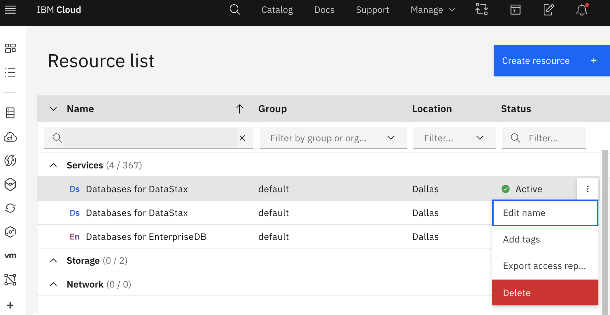

---

copyright:
  years: 2020
lastupdated: "2021-11-03"

subcollection: cloud-databases

keywords: deprovision cloud databases, databases with terraform, deprovisioning parameters, delete cloud databases

---

{:shortdesc: .shortdesc}
{:external: .external target="_blank"}
{:codeblock: .codeblock}
{:pre: .pre}
{:screen: .screen}
{:tip: .tip}
{:important: .important}	

# Deleting your Deployment and Removing your Data
{: #deprovisioning}

{{site.data.keyword.cloud}} Databases instances are softly deleted in production when you delete or deprovision the instance in {{site.data.keyword.cloud_notm}}. 

{{site.data.keyword.cloud_notm}} keeps the deployment in the "soft delete" state for 3 days before it issues a "delete". The soft delete state addresses use cases when you accidentally delete an instance. You can re-enable an existing soft-deleted instance on your own.

## Deleting your Deployment in the User Interface 
{: #delete-deployment-ui}

To delete your deployment instance from the Resource list section dashboard of the IBM Cloud dashboard, select your deployment. Next, by using the stacked three-dot menu icon (  ), choose `Delete` from the drop list. 

{: caption="Figure 1. List of service instances on the Resource List" caption-side="bottom"}

## Deleting your Deployment by using the CLI
{: #delete-deployment-cli}

By using the CLI, you can delete your existing {{site.data.keyword.cloud}} Databases instance with the [`ibmcloud resource service-instance-delete`](https://cloud.ibm.com/docs/cli?topic=cli-ibmcloud_commands_resource#ibmcloud_resource_service_instance_delete) command:
```bash
ibmcloud resource service-instance-delete my-service-instance
```
{: .pre}

Using the command `ibmcloud resource reclamation-delete` deletes a reclaimed resource so that the resource can no longer be restored.
{: .note}

## Deleting your database using DROP DATABASE Statement
{: #delete-deployment-statement}

[`DROP DATABASE`](https://dev.mysql.com/doc/refman/5.7/en/drop-database.html) drops all tables in the database and deletes the database. 

```bash
DROP {DATABASE | SCHEMA} [IF EXISTS] db_name
```
{: .pre}

## Deleting your database using `mysqladmin`
{: #delete-deployment-mysqladmin}

You can also drop databases with [`mysqladmin`, a MySQL Server Administration Program](https://dev.mysql.com/doc/refman/5.7/en/mysqladmin.html).
Invoke `mysqladmin` like this: 

```bash
mysqladmin [options] command [command-arg] [command [command-arg]] ...
```
{: .pre}

## Cryptoshredding keys
{: #cryptoshred}

{{site.data.keyword.keymanagementserviceshort}} provides for a [force delete](/docs/key-protect?topic=key-protect-delete-keys) of a key that is in use by {{site.data.keyword.cloud}} services, including your {{site.data.keyword.databases-for}} deployments. This action is called cryptoshredding. 

Cryptoshredding is a destructive action. When the key is deleted, your data is unrecoverable even from a soft delete state.
{: .important}

## Backups Removal
{: #backup-remove}

Backups cannot be manually deleted. However, if you delete your deployment, its backups are deleted automatically. 

## Reenabling from a soft delete
{: #reclamation}

You are able to discover available soft deleted instances by using the {{site.data.keyword.cloud_notm}} CLI [`ibmcloud resource reclamations`](https://cloud.ibm.com/docs/cli?topic=cli-ibmcloud_commands_resource#ibmcloud_resource_reclamations) command.

You can then "undelete", recover, or reclaim an available soft deleted instance by using the {{site.data.keyword.cloud_notm}} CLI [`ibmcloud resource reclamation-restore`](https://cloud.ibm.com/docs/cli?topic=cli-ibmcloud_commands_resource#ibmcloud_resource_reclamation_restore) command:
```bash
ibmcloud resource reclamation-restore resource_ID
```
{: .pre}
