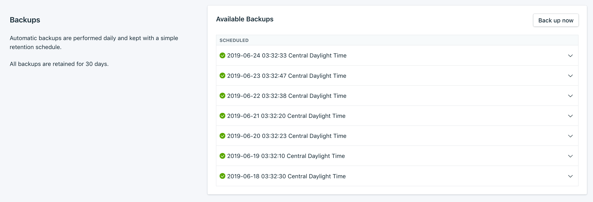

---

copyright:
  years: 2019, 2023
lastupdated: "2023-10-04"

subcollection: cloud-databases

keywords: backups, new deployment, source deployment, backup, back up, ondemand backup, on-demand backup, on-demand back up

---

{{site.data.keyword.attribute-definition-list}}

# Managing {{site.data.keyword.databases-for}} backups
{: #dashboard-backups}

Backups for {{site.data.keyword.databases-for}} deployments are accessible from the _Backups_ tab of your deployment's dashboard. Here is some additional general information about backups:

- Automatic backups are performed daily and kept with a simple retention schedule of 30 days.
- Backups cannot be deleted. 
- If you delete your deployment, its backups are deleted automatically.
- Daily backup scheduling is not configurable.
- Backups are restorable to other regions, except for `eu-de` and `par-01`, which can restore backups only between each other. For example, `par-01` backups can be restored to `eu-de`, and vice versa.
- Backup storage is encrypted. To manage the encryption keys, see [Key Protect integration](/docs/cloud-databases?topic=cloud-databases-key-protect#byok-for-backups). Otherwise, backups are encrypted with a key that is automatically generated for your deployment.
- Backups are restorable across accounts, but only through the API and only if the user that is running the restore has access to both the source and destination accounts.
- {{site.data.keyword.databases-for}} backups are not downloadable. If you need a local backup, use the appropriate software. For example, [pg_dump](https://www.postgresql.org/docs/9.6/static/backup-dump.html){: .external} is an effective tool for managing PostgreSQL backups.
- {{site.data.keyword.databases-for-cassandra_full}} does not support reenablement. After a deployment is disabled, that deployment must be restored from a backup.

For information on taking an on-demand backup, see [Taking an on-demand backup](/docs/cloud-databases?topic=cloud-databases-dashboard-backups&interface=cli#ondemand-backup).
{: tip}

## Backups in the UI
{: #backup-ui}
{: ui}

The backup types have their respective tabs, either _On-demand_ or _Automatic_. Each backup is listed with its type and when the backup was taken. Click the timestamp to change its format between elapsed time, local time, and Coordinated Universal Time. 

{: caption="Figure 1. List of backups on the Backups tab" caption-side="bottom"}

Click the backup to reveal information for that specific backup, including its full ID. A **Restore** button, or pre-formatted CLI command, is there for restore options. 

## Backups in the CLI
{: #backup-ui-cli}
{: cli}

You can access the list of backups and individual backup information from the {{site.data.keyword.databases-for}} CLI plug-in and the {{site.data.keyword.databases-for}} API.

Use the [`cdb deployment-backups-list`](/docs/databases-cli-plugin?topic=databases-cli-plugin-cdb-reference#deployment-backups-list) command to view the list of all available backups for your deployment. To get details about a specific backup, use the [`cdb backup-show`](/docs/databases-cli-plugin?topic=databases-cli-plugin-cdb-reference#backup-show) command.

For example, to view the backups for a deployment named "example-deployment", use the following command:

```sh
ibmcloud cdb deployment-backups-list example-deployment
```
{: .pre}

To see the details of one of the backups from the list, take the ID from the `ID` field of the `deployment-backups-list` response and use it with the `backup-show` command:

```sh
ibmcloud cdb backup-show crn:v1:staging:public:cloud-databases:us-south:a/6284014dd5b487c87a716f48aeeaf99f:3b4537bf-a585-4594-8262-2b1e24e2701e:backup:a3364821-d061-413f-a0df-6ba0e2951566
```
{: .pre}

## Backups in the {{site.data.keyword.databases-for}} API
{: #backup-ui-api}
{: api}

For backups information in the {{site.data.keyword.databases-for}} API, use the [`/deployments/{id}/backups`](https://cloud.ibm.com/apidocs/cloud-databases-api#get-currently-available-backups-from-a-deployment) endpoint to list the deployment's backups. To get information about a specific backup, use the [`/backups/{backup_id}`](https://{DomainName}/apidocs/cloud-databases-api#get-information-about-a-backup) endpoint.

## Taking an on-demand backup
{: #ondemand-backup}
{: cli}

If you plan to make major changes to your deployment, like scaling or removing databases, tables, collections, on-demand backups are useful. It can also be useful if you need to back up on a schedule. On-demand backups are kept for 30 days. 

Deployments come with backup storage equal to their total disk space at no cost. If your backup storage usage is greater than total disk space, each gigabyte is charged at an overage of $0.03/month. Backups are compressed, so even if you use on-demand backups, most deployments do not exceed the allotted credit.
{: .tip}

To create a manual backup in the UI, go to the _Backups_ tab of your deployment then click **Back up now**. A message is displayed that a backup is in progress, and an on-demand backup is added to the list of available backups.

In the CLI, an on-demand backup is triggered with the [`cdb deployment-backup-now`](/docs/databases-cli-plugin?topic=databases-cli-plugin-cdb-reference#deployment-backup-now) command.
```sh
ibmcloud cdb deployment-backup-now example-deployment
```
{: .pre}

In the API, sending a POST to the [`/deployments/{id}/backups`](https://cloud.ibm.com/apidocs/cloud-databases-api#initiate-an-on-demand-backup) endpoint triggers an on-demand backup.

## Restoring a backup
{: #restore-backup}

Backups are restored to a new deployment. After the new deployment finishes provisioning, your data in the backup file is restored into the new deployment.

By default, the new deployment is auto-sized to the same disk and memory allocation as the source deployment at the time of the backup from which you are restoring. To adjust the resources that are allocated to the new deployment, use the optional fields in the UI, CLI, or API to resize the new deployment. Be sure to allocate enough for your data and workload; if the deployment is not given enough resources, the restore fails.

Do not delete the source deployment while the backup is restoring. Before you delete the old deployment, wait until the new deployment is provisioned and the backup is restored. Deleting a deployment also deletes its backups.
{: .tip}

### Restoring a backup in the UI
{: #restore-backup-ui}
{: ui}

To restore a backup to a new service instance,

1. Click in the corresponding row to expand the options for the backup that you want to restore.
2. Click **Restore**.
3. Use the dialog box to select from some available options. 
    - The new deployment is automatically named `<name>-restore-[timestamp]`, but you can rename it. 
    - You can also select the region where the new deployment is located. Cross region restores are supported, except for restoring into or out of the `eu-de` region.
    - You can choose the initial resource allocation, either to expand or shrink the resources on the new deployment. You can also enable or disable dedicated cores.
4. Click **Restore**. A "restore from backup started" message appears. Clicking **Your new instance is available now.** takes you to your _Resources List_.

### Restoring a backup in the CLI
{: #restore-backup-cli}
{: cli}

The Resource Controller supports provisioning of database deployments, and provisioning and restoring are the responsibility of the Resource Controller CLI. Use the [`resource service-instance-create`](/docs/cli?topic=cli-ibmcloud_commands_resource#ibmcloud_resource_service_instance_create) command.

```sh
ibmcloud resource service-instance-create <SERVICE_INSTANCE_NAME> <service-id> standard <region> -p '{"backup_id":"BACKUP_ID"}'
```
{: .pre}

Change the value of `SERVICE_INSTANCE_NAME` to the name that you want for your new deployment. The `service-id` is the type of deployment, such as `databases-for-postgresql` or `messages-for-rabbitmq`. The `region` is where you want the new deployment to be located, which can be a different region from the source deployment. Cross region restores are supported, except for restoring to or from `eu-de` by using another region. `BACKUP_ID` is the backup that you want to restore.

Optional parameters are available through the CLI. Use them if you need to customize resources, or use a Key Protect key for BYOK encryption on the new deployment.
```sh
ibmcloud resource service-instance-create <SERVICE_INSTANCE_NAME> <service-id> standard <region> -p
'{"backup_id":"BACKUP_ID","key_protect_key":"KEY_PROTECT_KEY_CRN", "members_disk_allocation_mb":"DESIRED_DISK_IN_MB", "members_memory_allocation_mb":"DESIRED_MEMORY_IN_MB", "members_cpu_allocation_count":"NUMBER_OF_CORES"}'
```
{: .pre}

A pre-formatted command for a specific backup is available in detailed view of the backup on the _Backups_ tab of your deployment dashboard.
{: .tip}

### Restoring a backup through the API
{: #restore-backup-api}
{: api}

The [Resource Controller API](https://cloud.ibm.com/apidocs/resource-controller/resource-controller#create-resource-instance){: external} supports provisioning and restoring database deployments. The create request is a `POST` to the [`/resource_instances`](https://{DomainName}/apidocs/resource-controller#create-provision-a-new-resource-instance) endpoint.

```sh
curl -X POST \
  https://resource-controller.cloud.ibm.com/v2/resource_instances \
  -H 'Authorization: Bearer <>' \
  -H 'Content-Type: application/json' \
    -d '{
    "name": "<SERVICE_INSTANCE_NAME>",
    "target": "<region>",
    "resource_group": "<your-resource-group>",
    "resource_plan_id": "<service-id>",
    "parameters":{
      "backup_id": "<backup_id>"
    }
  }'
```
{: .pre}

The parameters `name`, `target`, `resource_group`, and `resource_plan_id` are all required, and `backup_id` is the backup that you want to restore. 
{: important}

The `target` is the region where you want the new deployment to be located, which can be a different region from the source deployment. Cross region restores are supported, except for restoring into or out of the `eu-de` region.

If you need to adjust resources or use a Key Protect key, add any of the optional parameters `key_protect_key`, `members_disk_allocation_mb`, `members_memory_allocation_mb`, and `members_cpu_allocation_count`, and their preferred values to the body of the request.


### Restoring a backup through Terraform
{: #restore-backup-tf}
{: terraform}

Use Terraform to restore to a backup from an older version to a new version.

1. Set your `backup_id`. For more information, see [`backup_id`](https://registry.terraform.io/providers/IBM-Cloud/ibm/latest/docs/resources/database#backup_id){: external}.
1. Set your `version` in the version attribute. For more information, see [`version`](https://registry.terraform.io/providers/IBM-Cloud/ibm/latest/docs/resources/database#backup_id){: external}.

The code will look like:

```tf
resource "ibm_database" "<your-instance>" {
  name                                 = "<your_database_name>"
  service                              = "<service>"
  plan                                 = "<plan>"
  location                             = "<region>"
  version                              = "<version>"
  backup_id                            = "<backup_id>"
}
```
{: codeblock}

For more information, see the [{{site.data.keyword.databases-for}} Terraform Registry](https://registry.terraform.io/providers/IBM-Cloud/ibm/latest/docs/resources/database#backup_id){: external}.

## Backups and Restoration
{: #backup-restoration}

* {{site.data.keyword.databases-for}} are not responsible for restoration, timeliness, or validity of said backups.
* Actions that you take as a user can compromise the integrity of backups, such as under-allocating memory and disk. Users can monitor that backups are successful by using the API, and periodically restore a backup to ensure validity and integrity. Users can retrieve the most recent-scheduled backup details from the [{{site.data.keyword.databases-for}} CLI plug-in](#backups-in-the-cli) and the [{{site.data.keyword.databases-for}} API](#restoring-a-backup-through-the-api).
* As a managed service, {{site.data.keyword.databases-for}} monitors the state of your backups and can attempt to remediate when possible. If you encounter issues from which you cannot recover, contact support for more help.

## Backup Locations
{: #backup-locations}

Backup location differs per database region. Ensure that the backup region location matches your data location requirements.

| Database Region | Backup Region |
|----------|---------|
| Dallas | US Cross Regional Object Storage |
| Washington D.C. | US Cross Regional Object Storage |
| London |	EU Cross Regional Object Storage |
| Frankfurt |	EU Cross Regional Object Storage |
| Tokyo	| AP Cross Regional Object Storage |
| Osaka	| AP Cross Regional Object Storage |
| Sydney	| AP Cross Regional Object Storage |
| Toronto |	Montreal Object Storage |
| Chennai |	Chennai Object Storage |
| Sao Paolo | Sao Paolo Object Storage |
{: caption="Table 1. Database and Backup Regions" caption-side="bottom"}

For more details about {{site.data.keyword.databases-for}} Object Storage locations, review the location's [documentation](/docs/cloud-object-storage?topic=cloud-object-storage-endpoints#endpoints-geo).

## Point-in-Time Recovery
{: #pitr-recovery-options}

With Point-in-Time Recovery (PITR), the deployment continuously backs up incrementally and can replay transactions to bring a new deployment that is restored from a backup to any point in the last 7 days. {{site.data.keyword.databases-for}} offers Point-In-Time Recovery (PITR) for the following services:

- [{{site.data.keyword.databases-for-mysql_full}}](/docs/databases-for-mysql?topic=databases-for-mysql-pitr) 
- [{{site.data.keyword.databases-for-postgresql_full}}](/docs/databases-for-postgresql?topic=databases-for-postgresql-pitr)
- [{{site.data.keyword.databases-for-enterprisedb_full}}](/docs/databases-for-enterprisedb?topic=databases-for-enterprisedb-pitr&interface=ui)
