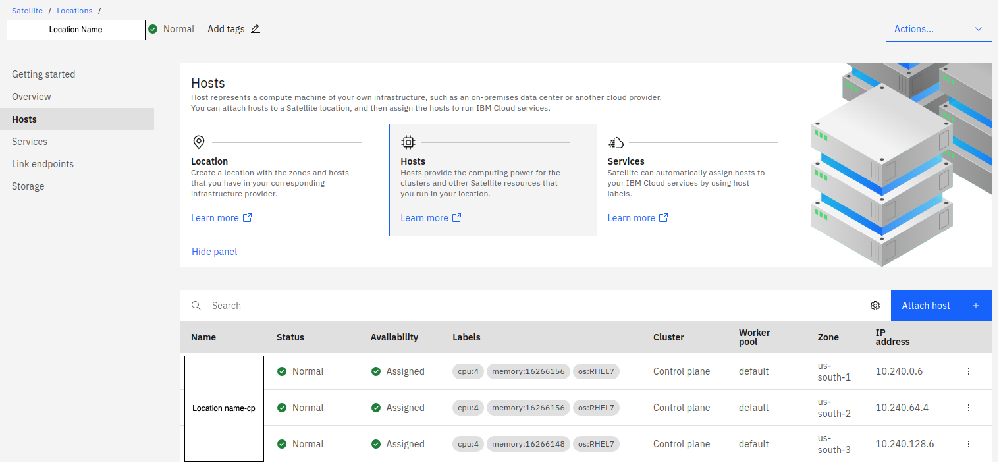

---

copyright:
  years: 2021
lastupdated: "2022-03-04"

keywords: IBM Cloud, databases, ICD

subcollection: cloud-databases

content-type: tutorial
completion-time: 15m

---

{:codeblock: .codeblock}
{:screen: .screen}
{:download: .download}
{:external: target="_blank" .external}
{:faq: data-hd-content-type='faq'}
{:gif: data-image-type='gif'}
{:important: .important}
{:note: .note}
{:pre: .pre}
{:tip: .tip}
{:preview: .preview}
{:deprecated: .deprecated}
{:beta: .beta}
{:term: .term}
{:shortdesc: .shortdesc}
{:script: data-hd-video='script'}
{:support: data-reuse='support'}
{:table: .aria-labeledby="caption"}
{:troubleshoot: data-hd-content-type='troubleshoot'}
{:help: data-hd-content-type='help'}
{:tsCauses: .tsCauses}
{:tsResolve: .tsResolve}
{:tsSymptoms: .tsSymptoms}
{:curl: .ph data-hd-programlang='curl'}
{:step: data-tutorial-type='step'}
{:tutorial: data-hd-content-type='tutorial'}
{:ui: .ph data-hd-interface='ui'}
{:cli: .ph data-hd-interface='cli'}
{:api: .ph data-hd-interface='api'}
{:important: .important}	

# Setting up Amazon Web Services Location
{: #satellite-aws}
{: toc-content-type="tutorial"}
{: toc-completion-time="15m"}

Follow the steps below to set up IBM Cloud™ Databases (ICD) enabled by IBM Cloud Satellite in an on-premises location.

## Prepare a Satellite location for IBM Cloud™ Databases
{: #prepare-satellite-location}
{: step}

Before deploying the ICD enabled by IBM Cloud Satellite service, you should prepare your Satellite location.

### Attach additional hosts to the Satellite location
{: #attach-additional-hosts}

These additional attached worker nodes are used to create a service cluster into which the database instances will later be deployed.
Attach to your Satellite location:

- three type **8x32** hosts
    - on AWS, choose three hosts of type **AWS m5d.2xlarge**
- three type **32x128** hosts
    - on AWS choose three hosts of type **AWS m5d.8xlarge**

The three type **8x32** hosts are for IBM Cloud™ Databases (ICD) enabled by IBM Cloud Satellite internal use, while the three type **32x128** hosts are for your use.
{: note}

### Create a Satellite block storage configuration
{: #satellite-blockstorage-config}

To set up your Satellite location using AWS, you should configure your block storage using [Amazon Elastic Block Storage (EBS)](/docs/satellite?topic=satellite-config-storage-ebs).

- To create a block storage configuration for your Satellite location, refer to [Creating an AWS EBS storage configuration](/docs/satellite?topic=satellite-config-storage-ebs).

- See below for an EBS storage configuration code example. For a full list of steps, consult the above documentation.

```bash
ibmcloud sat storage config create  \\
  --name 'aws-ebs-config-storage-testing-1' \\
  --template-name 'aws-ebs-csi-driver' \\
  --template-version '0.9.14' \\
  --location '${LOCATION_ID}' \\
  -p "aws-access-key=${SAT_EBS_ADMIN_KEY_ID}" \\
  -p "aws-secret-access-key=${SAT_EBS_ADMIN_KEY}"
```
{: pre}

## Grant a service authorization
{: step}
{: #service-authorization}

Begin by configuring IAM Authorizations:

- Configure your IAM Authorizations under the **Manage** tab.
- Choose the **Authorizations** tab from the left hand menu.
- Click the **create** button to create an authorization that will allow a service instance access to another service instance.
    - The source service is the service that is granted access to the target service. The roles you select define the level of access for this service. The target service is the service you are granting permission to be accessed by the source service based on the assigned roles.
    - In the **Source Service** field, select **Databases for < DATABASE TYPE >**.
    - In the **Target Service** field, select **Satellite**.
    - Select all options:
        - **Satellite Cluster Creator**
        - **Satellite Link Administrator**
        - **Satellite Link Source Access Controller**
    - Then **Authorize**.

## Ensure location readiness
{: step}
{: #loc-readiness}

Before provisioning your ICD Satellite Deployment, your location needs to report `Normal`. This status can be confirmed in the UI, as shown here:

{: caption="Figure 1. UI showing location is Normal" caption-side="bottom"}

`Normal` status can also be confirmed using the CLI, with a command like:

```shell
ibmcloud sat location get --location <location name> --output=json -q | jq -r .state
```
The command output should report `normal`.

### Obtaining `Normal` state
{: #norm-state}

To get to this state, attach a minimum of three 4x16 hosts to your location and assign them to the Control plane. Once that step is complete, provisioning of the Control plane will begin. Upon successful completion, the location state is going to report as `Normal`, as shown below: 

{: caption="Figure 1. Control plane in normal state" caption-side="bottom"}

Attempting to provision a database instance into a location without a running Control plane (i.e., `Normal` state), will cause provisioning to fail.
{: .important}

## Provisioning ICD Satellite Deployment
{: step}
{: #provision-deployment}

Once you have prepared your satellite location and granted service authorization, you can provision your ICD Satellite Deployment by selecting the Satellite location you have created in the **Location** dropdown of the provisioning page. For thorough documentation of the provisioning process, see the relevant [Provisioning documentation](/docs/cloud-databases?topic=cloud-databases-provisioning) for your ICD Satellite deployment. Once you have created a new service instance, this instance will appear in the IBM Cloud `Resource List` as `Provisioned`.

When you deploy the first database service instance, a service cluster will automatically be deployed into your Satellite location. The deployment of the service cluster can take up to one hour.

You can verify in the IBM Cloud UI whether the service cluster is already created:
- From the left hand **Navigation Menu**, select **Satellite**, then **Locations**.
- Select your Satellite location.
- Select **Services**

Once the service cluster is created, you must create a storage assignment manually (see next step) **before** the database instance will be started. Subsequent database service instances will provision more quickly since those will land on the same service cluster.
{: .important}

## Create a Storage Assignment
{: #create-storage-assignment-aws}

When the service cluster is available in your Satellite location, the next step is to create a Satellite storage assignment. This will allow the service cluster to create volumes on the previously configured storage.

Note that the first database you provision into a location will remain "Provision In Progress" until this step has been completed.
{: important}

Refer to [AWS EBS IBM Cloud Satellite documentation](/docs/satellite?topic=satellite-config-storage-ebs) for more information regarding AWS EBS.
{: note}

First, obtain your `ROKS-Service-cluster-ID` by entering the following command into the IBM Cloud CLI:

```bash
ic sat service ls  --location <location name/location id>
```
{: pre}

The output of the command will include the Cluster ID of the newly created Satellite service cluster. 

Use the Cluster ID as an input parameter for `--service-cluster-id` in the following AWS Satellite location storage assignment command:

```bash
ibmcloud sat storage assignment create  \\
    --name "ebs-assignment"  \\
    --service-cluster-id <ROKS-Service-cluster-ID>  \\
    --config 'aws-ebs-config-storage-testing-1'
```
{: pre}

Assigning a storage configuration to a service cluster will autogenerate a `--name` and any user-provided name will be ignored.
{: note}

After the storage assignment has been created, allow up to 30 minutes for the database instance to be ready for usage.
