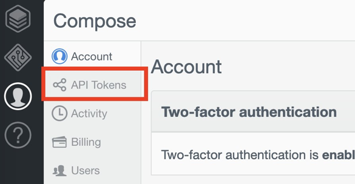
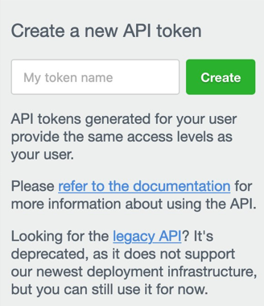
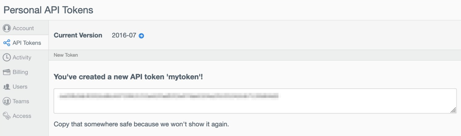

---
copyright:
  years: 2021
lastupdated: "2021-03-30"

keywords: Compose, cloud databases, migrating, disk size, memory size, CPU size, resources

subcollection: cloud-databases

---

{:shortdesc: .shortdesc}
{:new_window: target="_blank"}
{:codeblock: .codeblock}
{:pre: .pre}
{:screen: .screen}
{:tip: .tip}

# RAM, Disk, and CPU Sizing from Compose to IBM Cloud Databases
{: #compose-icd-sizing} 

If your database deployments are currently on Compose, the following information helps determine the starting allocation for RAM, disk, and CPUs needed for new deployments on IBM Cloud Databases. For convenience, step 3 includes a Python function where you can feed the RAM in MB and it writes the per-member and total allocation recommendations for your IBM Cloud Databases deployment. 

## Create a Compose API Token 

You can use the [Compose API](https://apidocs.compose.com/) to obtain the total amount of RAM and storage that is allocated to each deployment.

In order to use the Compose API, you need to create a unique API token for your account. Select **Account** from the Compose UI then click the **API Tokens** button. 



You are taken to the API tokens page. On the right, enter the name of your API token and click the “Create” button. 



When presented with your API token, make sure you save it.



You can revoke API tokens anytime and create new ones.

## Determine the Current Memory and Storage Size of your Compose Deployments 

With your API token, you can now use the Compose API. A list of all the API endpoints is available in the [Compose API reference](https://apidocs.compose.com/v1.0/reference).

In order to extract the information that you need to obtain the allocated RAM and storage for your deployment, you might want to install [jq](https://stedolan.github.io/jq/). The `jq` utility makes parsing the returned JSON objects from the API easier to understand.
{: .tip}

Export your API token from your console so that you can use it in the API request.  
```bash
export token=<compose api token>
```

Then, run the following command to get a list of the names and IDs of all your Compose deployments.
```curl
curl -s -X GET -H "Authorization: Bearer $token" \ 
    -H "Content-Type: application/json" \ 
    https://api.compose.io/2016-07/deployments | jq -c '.[][][] | {"id": .id, "name": .name}'
```

The response looks something like 
```json
{"id":"5aaaca0bq857341f057df390","name":"fearless-postgresql-70"} 
{"id":"5aaa501edra466001a1bf6c1","name":"spicy-mongodb-22"}
```

With the deployment IDs, you can extract the RAM and storage that is allocated to each data member of a deployment by using the `/deployments/<deployment id>/scalings` endpoint. For example, the request for the `spicy-mongodb-22` deployment is
```curl
curl -s -X GET -H "Authorization: Bearer $token" \ 
    -H "Content-Type: application/json" \ 
    "https://api.compose.io/2016-07/deployments/5aaa501edra466001a1bf6c1/scalings" | jq
```

And the response looks something like
```json
{ 
  "allocated_units": 1, 
  "used_units": 1, 
  "starting_units": 1, 
  "minimum_units": 1, 
  "unit_size_in_mb": 1024, 
  "memory_per_unit_in_mb": 102, 
  "storage_per_unit_in_mb": 1024, 
  "unit_type": "data" 
} 
```

The `allocated_units`, `memory_per_unit_in_mb`, and the `storage_per_unit_in_mb` keys are the important ones. `"allocated_units": 1` is the most basic unit; essentially, it’s a fresh deployment with the least amount of RAM and disk allocated to each member possible. As you add more units, you add more memory and storage in the amounts that are indicated by `memory_per_unit_in_mb` and `storage_per_unit_in_mb`. The same API request for the `fearless-postgresql-70` returns a response like
```json
{ 
  "allocated_units": 2, 
  "used_units": 1, 
  "starting_units": 1, 
  "minimum_units": 1, 
  "unit_size_in_mb": 1024, 
  "memory_per_unit_in_mb": 102, 
  "storage_per_unit_in_mb": 1024, 
  "unit_type": "data" 
} 
```

`"allocated_units": 2` indicates two units of memory and storage per data member. The amount of memory is multiplied by the `"memory_per_unit_in_mb": 102` (2 * 102 = 204 MB). Likewise, the amount of storage is multiplied by the `"storage_per_unit_in_mb": 1024` (2 * 1024 = 2048 MB).
 
A simple method to get the per member total with one request to the Compose API and jq is to run
```bash
$ curl -s -X GET -H "Authorization: Bearer $token" \
    -H "Content-Type: application/json" \ 
    "https://api.compose.io/2016-07/deployments/<deployment id>/scalings" | jq '{"RAM per member": (((.allocated_units * .memory_per_unit_in_mb) | tostring ) +  "mb"), "Storage per member": (((.allocated_units * .storage_per_unit_in_mb) | tostring ) +  "mb")}' | jq 
```

The response gives you something like
```json
{ 
  "RAM": "204mb", 
  "Storage": "2048mb" 
} 
```
This JSON object represents the memory of EACH of your database members you have in your Compose deployment. It’s important to note that for IBM Cloud Databases, you must consider that you have two or three members for each database in IBM Cloud Databases.  

For convenience, here’s a script that gives you the name, ID, units, and RAM allocated per member to all your Compose deployments.
```bash
export token=<Compose API token> 

for db in $(curl -s -X GET -H "Authorization: Bearer $token" -H "Content-Type: application/json" https://api.compose.io/2016-07/deployments | jq -c '.[][][] | {"id": .id, "name": .name}'); do

    echo ${db} | jq -r '"Compose Deployment ID: " + .id, "Compose Deployment Name: " + .name'   id=$(echo ${db} | jq -r '.id') 

    echo $(curl -s -X GET -H "Authorization: Bearer $token" -H "Content-Type: application/json" "https://api.compose.io/2016-07/deployments/$id/scalings" | jq '{"RAM per member": (((.allocated_units * .memory_per_unit_in_mb) | tostring ) +  "mb"), "Storage per member": (((.allocated_units * .storage_per_unit_in_mb) | tostring ) +  "mb")}') | jq 
 
    echo "---" 
done
```

## Map the Compose deployment's Resources to IBM Cloud Databases

Determining how much Disk, IOPS, and CPU breaks down to how much storage you require and how your database is being used (for example, does it have many I/O operations?). Memory resource allocation is similar between Compose and IBM Cloud Databases.

**RAM**  
The general rule for memory is to provide the same amount of memory (or more) allotted to the Compose deployment to the new IBM Cloud Database. The minimum memory allocation for an IBM Cloud Databases deployment is 1 GB per member.

**Disk**  
Disk space (storage) is not 1:1 between Compose and IBM Cloud Databases.  In addition to the amount of data storage, the disk space allocation of an IBM Cloud Databases deployment impacts the amount of IOPS that the disk is given. You receive 10 IOPS per GB of allocated disk and IOPS affects read/write throughput of the underlying database’s disk, which is another consideration. For Disk, the recommended sizes are based on of sizes of 128 GB, 256 GB, 512 GB, 768 GB, 1024 GB, and 1168 GB so that there are significant jumps in IOPS. 

**CPU**  
CPU allocation also does not have a direct mapping between Compose and IBM Cloud Databases. The CPU allocation of an IBM Cloud Database deployment reserves a minimum set of CPUs on a host to support your database’s workload. This is not available on Compose, and CPU needs vary by workload. For CPU, the recommended sizes are based on of sizes of 3, 9, and 27 cores based on the performance needs for your application. You might also decide not to allocate dedicated cores to your IBM Cloud deployments that are used for development purposes or are less active.

In general, these suggestions are for simplicity and you can choose different values and multiples if you expect your application to require more CPU or IOPS (Disk).

Following is an estimation function to derive a starting configuration for your IBM Cloud Databases deployment based on the RAM configuration on Compose in MB and where you fall between the minimum size and maximum size of an IBM Cloud Databases deployment. 
```python
RAM_MAX_GB = 112
CPU = [3, 9, 27]
DISK = [128, 256, 512, 768, 1024, 1152]

def estimate(compose_ram, db_type = None):
    import math
    ram_percent = min(compose_ram, RAM_MAX_GB) * 1.0 / RAM_MAX_GB 
    member_count = 2

    if db_type == 'elasticsearch' or db_type == 'etcd': 
        member_count = 3

    cpu = CPU[min(int(round(ram_percent * len(CPU))), len(CPU) - 1)]
    disk = DISK[min(int(round(ram_percent * len(DISK))), len(DISK) - 1)] 
    ram = int(math.ceil(compose_ram))

    print("Per-Member:")
    print("    RAM: {}, CPUs: {}, disk: {} GB".format(ram, cpu, disk))
    print("Total Allocation:")
    
    total_ram = ram * member_count * 1024
    total_cpu = cpu * member_count
    total_disk = disk * member_count * 1024
    
    print("    RAM: {} MB, CPUs: {}, disk: {} MB".format(total_ram, total_cpu, total_disk))
```

Examples: 
- For the Compose for PostgreSQL example with 5 GB RAM, you get: 
    ```bash
    >>> estimate(5120, 'postgresql') 
    Per-Member: 
        RAM: 5 GB, CPUs: 3, disk: 128 GB 
    Total Allocation: 
        RAM: 10240 MB, CPUs: 6, disk: 262144 MB 
    ```
- For a Compose for Elasticsearch deployment with 5 GB RAM, you get 
    ```bash
    >>> estimate(5120, 'elasticsearch') 
    Per-Member: 
        RAM: 5 GB, CPUs: 3, disk: 128 GB 
    Total Allocation: 
        RAM: 15360 MB, CPUs: 9, disk: 393216 MB 
    ```

## Provisioning the IBM Cloud Databases Deployment  

You can provision an IBM Cloud Databases deployment by using the [IBM Cloud catalog](https://cloud.ibm.com/catalog?category=databases) or the [IBM Cloud CLI](/docs/cli?topic=cli-install-ibmcloud-cli). The catalog does not provide as much granularity when selecting the resources for your deployment, so this example uses the Python script from step 3 and use the IBM Cloud CLI to provision the deployment.

The syntax for provisioning a deployment by using the IBM Cloud CLI looks like
```bash
ibmcloud resource service-instance-create <name> databases-for-postgresql standard <region> -p '{"members_memory_allocation_mb": "<total_memory>", "members_disk_allocation_mb": "<total_disk>", "members_cpu_allocation_count": "<total_cpu>" }' 
```

Assume that you have 510 MB of RAM and 5 GB of storage that is allocated to a Compose for PostgreSQL deployment and you want to provision a Databases for PostgreSQL database. The estimation function in the previous section accepts the per-member allocation in MB for your Compose deployment as returned by the API in Step 1.  So, using 510 MB RAM into the estimation function yields 
```bash
>>> estimate(510, “postgresql”) Per-Member: 
    RAM: 1 GB, CPUs: 3, disk: 128 GB 
Total Allocation: 
    RAM: 2048 MB, CPUs: 6, disk: 262144 MB 
```
The recommendation is to provision an IBM Cloud Databases deployment with 1 GB of RAM, 3 CPU cores, and 128 GB disk per member.  If this is a development deployment, or other low-priority deployment, you can choose to provision at 0 CPU cores. 

The IBM Cloud CLI requires you to send the total resource allocation for the IBM Cloud 
Databases deployment in the provision request.  So use numbers from the "Total Allocation" and plug them into the IBM Cloud CLI command
```bash
ibmcloud resource service-instance-create <name> databases-for-postgresql standard <region> -p '{"members_memory_allocation_mb": "2048", "members_disk_allocation_mb": "262144", "members_cpu_allocation_count": "6" }' 
```

Behind the scenes, this function is doing math based on member counts to derive the values to plug into `<total_memory>`, `<total_disk>`, and `<total_cpu>`. 
- `total_memory = member_count * ram_per_member * 1024`
- `total_disk = member_count * disk_per_member * 1024`
- `total_cpu = member_count * cpu_per_member`

The value of `member_count` depends on the database type that you’re provisioning.  Databases for PostgreSQL, Databases for MongoDB, and Databases for Redis have two data members (2 GB RAM total to start).  Databases for etcd, Databases for Elasticsearch, and Messages for RabbitMQ have three data members (3 GB RAM total to start). 
 
So for the example PostgreSQL, the total allocations are
- `total_memory = 2 * 1 * 1024 = 2048`
- `total_disk= 2 * 128 * 1024 = 262144`
- `total_cpu = 2 * 3 = 6`

## Monitoring the IBM Cloud Databases Deployment

You now have an IBM Cloud Databases deployment that approximates the resource allocation of your Compose deployment. To determine whether you need more resources, look at monitoring your databases. Monitoring for {{site.data.keyword.databases-for}} deployments is provided through integration with the [{{site.data.keyword.monitoringfull}}](/docs/monitoring?topic=monitoring-getting-started) service. With it you can monitor the memory, disk, disk I/O utilization, and CPU usage of each of your deployments. 

Deployments can be both manually scaled to your usage, or configured to autoscale under certain resource conditions.
If you find that you’re using too much CPU, you can allocate more. Likewise, if you find that you’re running out of disk space, allocate a little more. You can use our increment suggestions or use your own allocations. 
