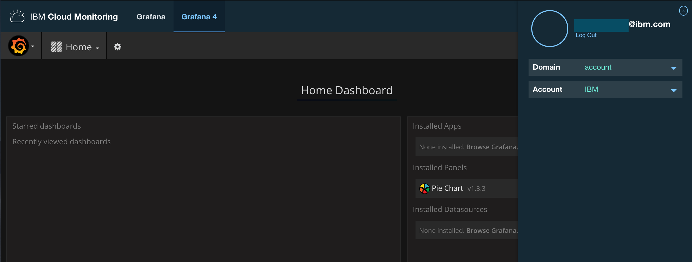
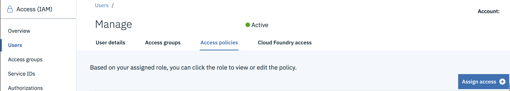
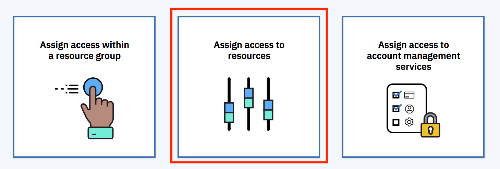
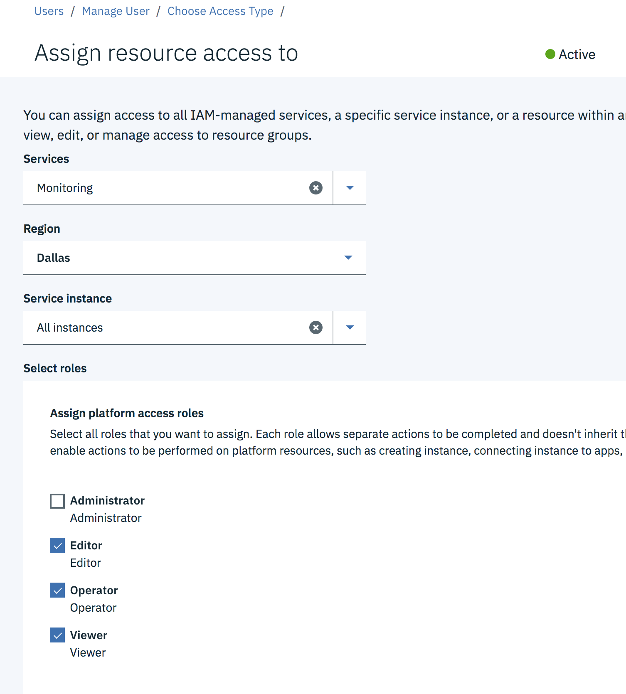
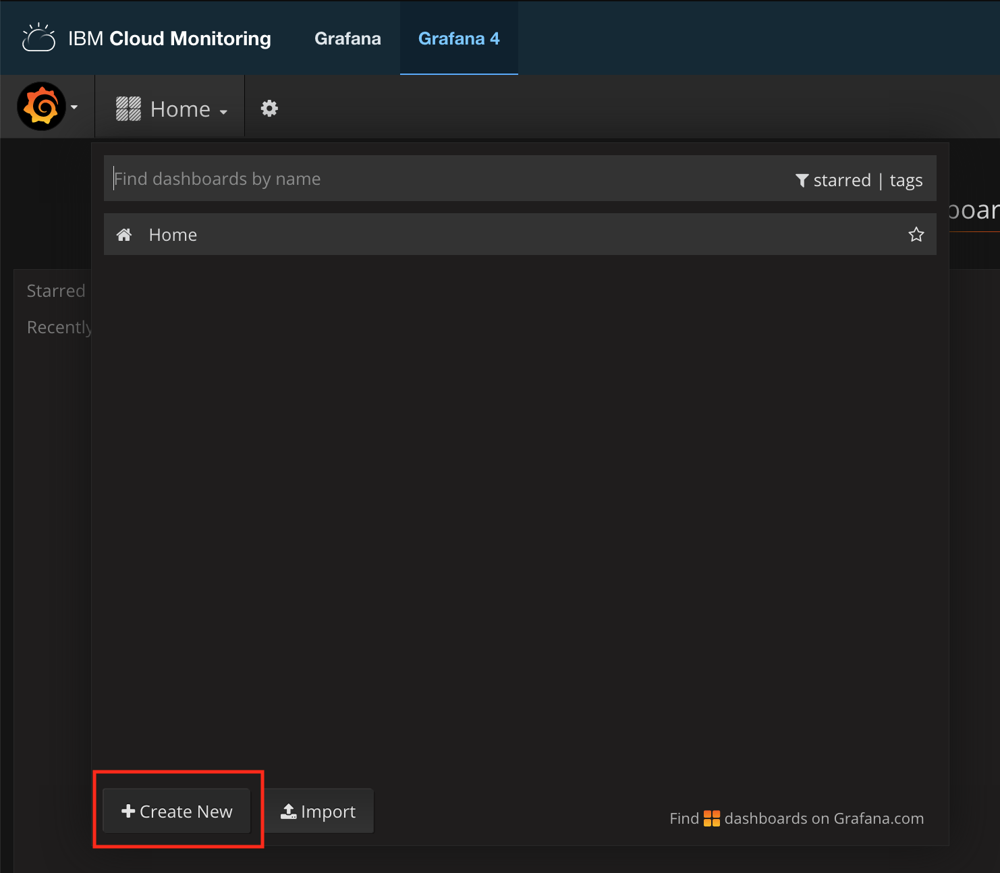
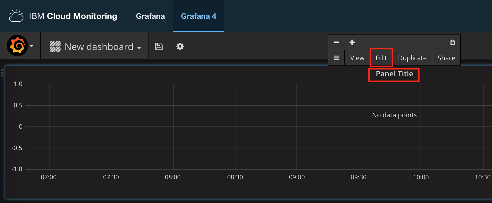
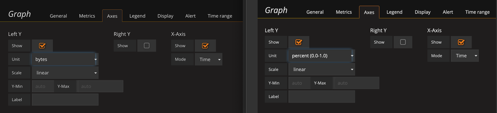
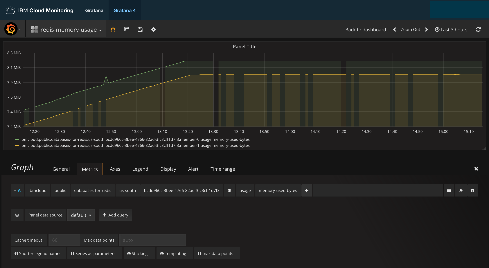
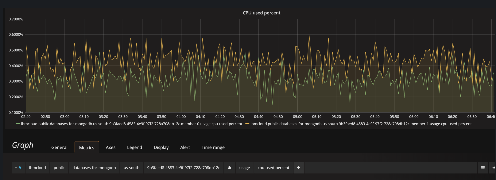
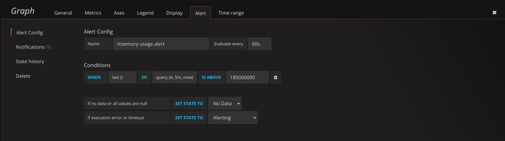

---

Copyright:
  years: 2019
lastupdated: "2019-11-15"

keywords: cloud databases

subcollection: cloud-databases

---

{:new_window: target="_blank"}
{:shortdesc: .shortdesc}
{:screen: .screen}
{:codeblock: .codeblock}
{:pre: .pre}
{:tip: .tip}


# Monitoring Integration
{: #monitoring}

Monitoring for {{site.data.keyword.databases-for}} deployments is provided through integration with the {{site.data.keyword.cloud}} Monitoring service. Your deployments forward information about memory, disk space, and disk I/O utilization. If you have provisioned or scaled your deployment to use dedicated CPU cores, there is also a metric for CPU usage as a percent of total CPU available. If your deployment outgrows its allocated resources, you can scale up to keep it running smoothly.

Additional metrics vary by database type. For available metrics by database, see the [Available Metrics](#available-metrics).
{: .tip} 

## Configuring IBM Cloud Monitoring

You can access Monitoring through the _Observability_ tab of your deployment's _Manage_ page.  Click **Manage Monitoring Service** to view the Monitoring Dashboard. Under the hood, Monitoring access is split by region, and you can also access your deployments' monitoring from region-specific URLs. Use the following table to access your deployments' monitoring in the region where the deployment resides.

Deployment Region|Monitoring Region|Monitoring Link
----------|-----------|-----------
Oslo | Frankfurt | https://metrics.eu-de.bluemix.net
Tokyo | Sydney | https://metrics.au-syd.bluemix.net
Sydney | Sydney | https://metrics.au-syd.bluemix.net
Frankfurt | Frankfurt | https://metrics.eu-de.bluemix.net
Dallas | Dallas | https://metrics.ng.bluemix.net
Washington | Dallas | https://metrics.ng.bluemix.net
London | London | https://metrics.eu-gb.bluemix.net
Seoul | Sydney | https://metrics.au-syd.bluemix.net
Chennai | Sydney | https://metrics.au-syd.bluemix.net
{: caption="Table 1. Monitoring service regions" caption-side="top"}

If you aren't currently logged in to your IBM Cloud account when accessing the links, it asks you to log in.

By default, the monitoring service displays information that is related to services you have under your Domain, Account, Organization, and Space. {{site.data.keyword.databases-for}} deployments send metrics that are scoped to the Account level. Click your account name in the upper-left and select "account" from the _Domain_ drop-down menu.



### User Access to Monitoring

Some users experience authorization issues when trying to access account level metrics in their IBM Monitoring instance. Non-account owners see the error message

```
{
  "errors": [
    {
      "code": "BXNMSAL18E",
      "message": "Subject 'user@ibm.com' is not authorized to perform this action"
    }
  ]
}
```

Owners need to go to [`Manage -> Access (IAM) -> Users`](https://cloud.ibm.com/iam/users). Click the user you need to grant access to Monitoring. Then click 'Access policies' followed by the 'Assign access' button.



The Monitoring Service is a Cloud Foundry service, you need to grant access by going through the **Assign access to resources** button.



Which leads to a screen that allows you to grant access for different services on your account to a user.



'Services: Monitoring' and the shown 'Roles' must be selected. 'Region' and 'Service Instance' can be set for the Monitoring instance you need users to access.

## Configuring a Grafana Graph

To display the usage metrics for your deployment, create a new dashboard. 



Select the format for your information. Click _Panel Title_ and _Edit_. A configuration section appears and you configure the metrics that you want to display from the _Metrics_ tab.



Click _select metric_ and choose _ibmcloud_. Then, following the form across, select _public_.

Select the service name of the deployment you want to monitor on this graph and the region where it is deployed.


 
After the region field is an ID field. The ID corresponds to the last part of your deployment's ID. For example, if your Deployment ID is,


then the ID in the field is `ef400bd3-cb95-486e-b54c-18dae5477801`.

The next field contains a list of the data members of your deployment. You can customize the graph to show all of the members or just one. The next field is _usage_, and the last field lists what metrics you can add to be displayed to the graph.

The final setting to configure is the _Axes_. Click the _Axes_ tab. For memory and disk usage, you can uncheck the _Right Y_ axis, and then set the _Left Y_ axis units to _"data (IEC)"_, _bytes_. For CPU usage (if you have dedicated cores), set it to _"percent (0.0-1.0)"_.



The first example graph shows the memory usage for all data members of a {{site.data.keyword.databases-for-redis}} deployment.



The second example graph shows the CPU usage for all data members of a {{site.data.keyword.databases-for-mongodb}} deployment.



Once the graph is configured, click the _Save_ icon and give it a name. It appears in your list of dashboards.

## Configuring Alerts

Once you have a graph with the metrics that you want to monitor, you can set up alerts to notify you under certain conditions. For example, an alert for memory usage above 180 MiB is shown.



Be sure to click the _Save_ icon to save the alert.

## Available Metrics

The tables describe all the available metrics for {{site.data.keyword.databases-for}} deployments.

### All {{site.data.keyword.databases-for}} deployments

Metric | Description | Left Y Axis 
----------|-----------|---------- 
`disk-total-bytes` | Represents the total amount of disk available to your deployment. | `data (IEC)`, `bytes`
`disk-used-bytes` | How much disk your deployment is using. | `data (IEC)`, `bytes`
`memory-limit-bytes` | The maximum amount of memory available to your deployment. | `data (IEC)`, `bytes`
`memory-used-bytes` | How much memory your deployment is using. | `data (IEC)`, `bytes`
`cpu-used-percent` | How much CPU is used as a percentage of total CPU available. Only for deployments that have dedicated CPU. | `percent (0.0-1.0)`
`io-utilization-percent-average-<x>m` | How much disk I/O has been used over `x` minutes as a percentage of total disk I/O available. | `percent (0.0-1.0)`
`iops-read-write-total` | How many input-output operations per second your deployment is performing. | default
{: caption="Table 2.{{site.data.keyword.databases-for}} metrics" caption-side="top"}

### {{site.data.keyword.databases-for-elasticsearch}} deployments

Metric | Description | Left Y Axis 
----------|-----------|---------
`usage.jvm-heap-percent` | How much JVM heap is used as a percentage of total JVM heap is available. | `percent (0.0-1.0)`
`cluster.unassigned-shards-total` | Number of unassigned shards. | default
`cluster.status` | A number derived from the `status` value of the [`/_cluster/health` endpoint](https://www.elastic.co/guide/en/elasticsearch/reference/current/cluster-health.html). Possible Values: 'green' = 1.0, 'yellow' = 0.5, 'red' = 0, ERROR = -1 | default
{: caption="Table 3.{{site.data.keyword.databases-for-elasticsearch}} metrics" caption-side="top"}

### {{site.data.keyword.databases-for-mongodb}} deployments

Metric | Description | Left Y Axis 
----------|----------|---------
`usage.page-faults` | The number of times per second that MongoDB had to request data from disk. Scale RAM to reduce the number of disk requests. | default
`usage.connections` | The number of connections to the database. | default
`cluster.status` | An integer between 0 and 10 that represents the [replica state](https://docs.mongodb.com/manual/reference/replica-states/) of the current member. | default
{: caption="Table 4.{{site.data.keyword.databases-for-mongodb}} metrics" caption-side="top"}

### {{site.data.keyword.databases-for-postgresql}} deployments

Metric | Description | Left Y Axis 
----------|----------|---------
`cluster.total-connections` | The total number of [PostgreSQL connections](/docs/services/databases-for-postgresql?topic=databases-for-postgresql-managing-connections) being used. | default
`cluster.replication-lag-bytes` | How far behind a [PostgreSQL read-only replica](/docs/services/databases-for-postgresql?topic=databases-for-postgresql-read-only-replicas) is, in bytes | `data (IEC)`, `bytes`
{: caption="Table 5.{{site.data.keyword.databases-for-postgresql}} metrics" caption-side="top"}


