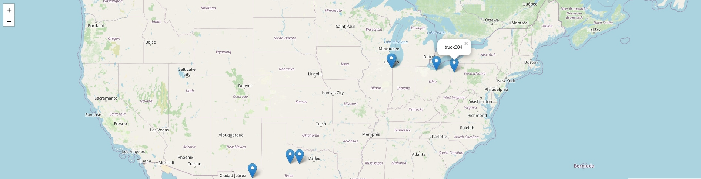

---
copyright:
  years: 2019, 2021
lastupdated: "2022-02-15"

keywords: IBM Cloud Databases, ICD, truck tracker, terraform, docker

subcollection: cloud-databases
---

{:external: .external target="_blank"}
{:shortdesc: .shortdesc}
{:screen: .screen}
{:codeblock: .codeblock}
{:pre: .pre}
{:tip: .tip}
{:note: .note}

# Truck Tracker: An IoT Pattern Using IBM Cloud Services
{: #truck-tracker-ibmcloud}

## A use case on how to combine different IBM Cloud services to produce a variety of insights.
{: #truck-tracker-use-case}

The Internet of Things (IoT) is a term used (and often misused) in all sorts of contexts. But its core idea — that more and more devices can be and are being put online, and that those devices can be great sources of information — is real and exciting.

All sorts of use cases are constantly emerging where Internet-connected devices generate data that can be used in many innovative ways.

The trick then becomes being able to ingest that data and turn it into insights, and that normally requires multiple services and technologies working in tandem to produce the desired outcome.

## Truck Tracker: One data point, multiple uses
{: #truck-tracker-data-uses}

For this tutorial, we will focus on one such use case to illustrate how you might combine different IBM Cloud services to produce a variety of insights.

Truck Tracker is a service that receives data from a fleet of trucks as they travel across the country. It could be any data (e.g., fuel consumption, driver details, ambient temperature or anything else that can be measured as you cruise). For the purposes of this post, it will be the truck's ID and position (lat/long coordinates). Truck Tracker will store the data in various data stores and also show you the current position of the trucks on a map.

Some app users need this data to run analytics. For example, to find out how many miles the fleet has travelled in the last 24 hours or how much fuel it has consumed. For that, all data points can be stored in a reliable document store like [IBM Cloudant](https://www.ibm.com/cloud/cloudant) and searched and aggregated at will. IBM Cloudant is a fully managed, distributed database optimized for heavy workloads and fast-growing web and mobile apps. 

Other users might need to know where the trucks currently are. For this, you only need the last known position of each truck. In this case, [Redis](https://www.ibm.com/cloud/learn/redis) is a perfect solution — a fast key-value store where a key is the unique truck ID and the value is its last known position.

[IBM Databases for Redis](https://www.ibm.com/cloud/databases-for-redis) is a fully managed in-memory data structure store that can be used as a database, cache and message broker. 

There may be other, yet unknown, uses for the data that require it to be accessed or stored in different ways. So your trucks are flying around the country and data is pouring out of them. How do you make sure everyone gets the data they need? Enter [IBM Event Streams](https://www.ibm.com/cloud/event-streams), an event-streaming platform that helps you build smart apps that can react to events as they happen. It is a fully managed service built on open-source [Apache Kafka](https://www.ibm.com/cloud/learn/apache-kafka).

Event Streams can take in the data from the trucks (data producers) and then serve it to the various applications that will use it (data consumers).

Finally, you will need to run your Truck Tracker service somewhere, and for that, we will use [IBM Cloud Code Engine](https://www.ibm.com/cloud/code-engine), a fully managed, serverless platform that runs your [containerized](https://www.ibm.com/cloud/learn/containerization) workloads, including web apps, [microservices](https://www.ibm.com/cloud/learn/microservices), event-driven functions or batch jobs. 

The fully-managed nature of all these services allows you to focus on developing your applications instead of having to worry about security, scaling, patching and all the other overhead that comes from deploying your own infrastructure.

## The Solution
{: #truck-tracker-solution}

This is the high-level system that we are going to build:

{: caption="Figure 1. The Truck Tracker Solution" caption-side="bottom"}

In a real-life scenario, your data generators (the truck's IoT devices) would have to find a way to communicate with the Event Streams application, probably using the MQTT protocol. We will simulate our trucks traveling around the country and sending data by using a script (producer.js) that will be generating a truck location every second by reading from a predefined set of lat/long pairs of a couple of "road trips" (LAToDallas.json and boulderToNYC.json) and feeding it into Event Streams. 

This tutorial should take you less than an hour to complete. It will not be entirely cost-free because some of the IBM services do not come with a free tier, but if you deprovision the services after completing it, you should not have to pay more than a few dollars.

## Getting productive 
{: #truck-tracker-prod-tools}

Before you begin, it's a good idea to install some necessary productivity tools:

- An [IBM Cloud](https://cloud.ibm.com/login) pay-as-you-go account
- The [{{site.data.keyword.databases-for}} CLI plug-in](https://cloud.ibm.com/docs/databases-cli-plugin) - the command line interface to interact with the [{{site.data.keyword.databases-for}} API](https://cloud.ibm.com/apidocs/cloud-databases-api/cloud-databases-api-v5#introduction). Also, make sure it is [logged in to your account.](https://cloud.ibm.com/docs/cli?topic=cli-getting-started#step4-configure-idt-env)
- Make sure you have access to a Mac or Linux terminal.
- [The Kubernetes CLI](https://kubernetes.io/docs/tasks/tools/install-kubectl/) - a command line interface for running commands against Kubernetes clusters.
- [Terraform](https://learn.hashicorp.com/tutorials/terraform/install-cli) - automates your resource provisioning
- [Docker](https://docs.docker.com/engine/install/) We will be using Docker to create the images that will run your code in Code Engine — make sure you are logged into your Docker account
- [jq](https://stedolan.github.io/jq/) - a lightweight and flexible command-line JSON processor
- [Git](https://git-scm.com/book/en/v2/Getting-Started-Installing-Git) - a free and open source distributed version control system
- [Node.js and npm](https://docs.npmjs.com/downloading-and-installing-node-js-and-npm)

### Step 1: Obtain an API key to deploy infrastructure to your account
{: #truck-tracker-api-key}

Follow the steps [in this document](https://cloud.ibm.com/docs/account?topic=account-userapikey&interface=ui#create_user_key) to create an API key and make a note of it for Step 2.


### Step 2: Clone the repo and cd into the Terraform directory
{: #truck-tracker-terraform-dir}

```shell
git clone https://github.com/danmermel/trucktracker.git
cd trucktracker/terraform
```

Create a document called terraform.tfvars with the following fields: 

```shell
ibmcloud_api_key = "<your_api_key_from_step_1>"
region = "eu-gb"
redis_password  = "<make_up_a_password>"
```

The terraform.tfvars document contains variables that you may want to keep secret so it is ignored by the GitHub repository.

### Step 3: Create the infrastructure
{: #truck-tracker-infra}

TL;DR — run the Terraform script:

```shell
terraform init 
terraform apply --auto-approve
```

The Terraform folder contains a number of simple scripts: 

- main.tf tells Terraform to use the IBM Cloud.
- variables.tf contains the variable definitions whose values will be populated from terraform.tfvars.
- cloudant.tf creates a free tier Cloudant DB and some credentials that we will use later to access it.
- redis.tf creates the Redis instance and some credentials that we will use later to access it.
- eventstreams.tf creates the Event Streams instance and some credentials that we will use later to access it.
- registry.tf creates the Container Registry that will hold your container images.
- iam.tf creates the access key that is needed to interact with the Container Registry.

It will take several minutes for the databases and other resources to be ready, but you should now you have a Databases for Redis instance, a Cloudant database and an Event Streams instance in your account, as well as a Container Registry namespace for your container images. You can check by visiting the Resources section of your IBM Cloud account.

### Step 4: Create container images and deploy to Code Engine
{: #truck-tracker-code-engine}

At this point, all your infrastructure is ready to receive data. Now we have to build the different modules that will produce and consume the data, as well as the application that will display the truck position on a map.

Run the build script — but before you do, are you logged into the IBM Cloud CLI and Docker?

Go into the root of the project and type the following:

```shell
./build.sh
```


### Step 5: Watch your trucks truckin'
{: #truck-tracker-trucking}

The end of the script will output a URL — something like https://webserver.xyz1234.eu-gb.codeengine.appdomain.cloud.

If you visit that URL, you should be able to see a map of the US and, after a few seconds, several markers on the map that represent your trucks:

{: caption="Figure 1. The Truck Tracker Solution" caption-side="bottom"}

If you zoom in on one of these markers you will see it moving along the road. As the fleet manager, you now know where all your trucks are.

### What Just Happened?
{: #truck-tracker-what-happened}

The Truck Tracker system is a set of simple Node.js scripts that use four main packages:

1. [@ibm-cloud/cloudant](https://github.com/IBM/cloudant-node-sdk) to connect to IBM Cloudant and read/write data.
1. [Redis](https://www.npmjs.com/package/redis) to connect to the Redis instance and read/write data.
1. [kafkajs](https://www.npmjs.com/package/kafkajs) to connect to the Event Streams instance.
1. [Express](https://expressjs.com/) to enable a simple web server that allows interaction with the data.

There are five main files:

1. server.js: This runs the web server and communicates with Redis. It is getting regular calls from the front end to the /data route. It connects to Redis, downloads an object with the ID and position of every truck and returns that to the front end.
1. index.html: This is the one and only page of the front end application. When it loads, it shows a map of the US from the awesome Open Street Map service. Then it is on a five-second loop where it makes an HTTP request to the backend (server.js), retrieves all the trucks and their positions and loops through them to plot their latest position on the map. Each truck has a map marker whose lat/long gets updated with every cycle.
1. producer.js: This takes in a location file and a truck IS from the script invocation and then loops through all the data points in the location file. Each data point is turned into a message with the truck ID and lat/long and posted once a second to Event Streams. For added fun, it picks a random starting point along the route and turns around and comes back when it reaches the end of the location file.
1. cloudantConsumer.js: This script creates a trucktracker database in Cloudant if it does not already exist and then polls Event Streams at regular intervals for more data. When data comes in, it gets written in bulk to Cloudant.
1. redisConsumer.js: This script polls Event Streams at regular intervals for data. When data comes in, it gets written into a Redis "hash" where the hash key is the truck ID and the value is the truck data (lat/long). This hash arrangement allows all the truck data to be pulled down by the server.js script in one go. The great thing is that if for some reason one of your consumers crashes, it will pick up where it left off without losing any data, because Event Streams knows the last data point it served to each consumer. Decoupling data-producing systems from data-consuming systems in this way is a good design practice that increases resilience and fault tolerance.

### The Docker Bit
{: #truck-tracker-docker-bit}

The producer, consumers and web application are all in different folders. Each folder has its own simple Dockerfile file that is used by the build.sh script to create a container image, which is then uploaded to the IBM Container Registry.

The script then instructs Code Engine to pull these images in turn and run the workloads for you. 

### Summary
{: #truck-tracker-summary}

In this tutorial, we have combined a number of IBM services to model a realistic IoT pattern where Internet-enabled devices on trucks are producing data that gets consumed by various applications for different purposes. 

Because of the managed nature of all these services, as an application developer, you can focus on solving your business problems and leave us to do the heavy lifting of managing the infrastructure for you, thereby saving potentially months of work on non-core activities like server provisioning, software deployment, patching, security and others.

If you followed this tutorial, remember to de-provision your infrastructure to stop incurring charges. On your terminal, do the following:

```shell
cd terraform/
terraform destroy
ibmcloud ce project delete --name trucktracker --hard
```
If you want to take the next step in your developer journey, check out some of our [trial offers](https://www.ibm.com/products?types[0]=trial). 
